# [📈 Live Status](https://freehostinguptime.tinkerhost.net): <!--live status--> **🟩 All systems operational**

This repository contains the open-source uptime monitor and status page for [TinkerHost](https://tinkerhost.net), powered by [Upptime](https://github.com/upptime/upptime).

With [Upptime](https://upptime.js.org), you can get your own unlimited and free uptime monitor and status page, powered entirely by a GitHub repository. We use [Issues](https://github.com/TinkerHost/upptime-free-hosting-servers/issues) as incident reports, [Actions](https://github.com/TinkerHost/upptime-free-hosting-servers/actions) as uptime monitors, and [Pages](https://freehostinguptime.tinkerhost.net) for the status page.

<!--start: status pages-->
<!-- This summary is generated by Upptime (https://github.com/upptime/upptime) -->
<!-- Do not edit this manually, your changes will be overwritten -->
<!-- prettier-ignore -->
| URL | Status | History | Response Time | Uptime |
| --- | ------ | ------- | ------------- | ------ |
|  B183 | 🟩 Up | [b183.yml](https://github.com/TinkerHost/upptime-free-hosting-servers/commits/HEAD/history/b183.yml) | 

 103ms
     
 | 

<a href="https://freehostinguptime.tinkerhost.net/history/b183">74.18%</a>
    

|  A185 | 🟩 Up | [a185.yml](https://github.com/TinkerHost/upptime-free-hosting-servers/commits/HEAD/history/a185.yml) | 

 114ms
     
 | 

<a href="https://freehostinguptime.tinkerhost.net/history/a185">74.39%</a>
    

|  H101 | 🟩 Up | [h101.yml](https://github.com/TinkerHost/upptime-free-hosting-servers/commits/HEAD/history/h101.yml) | 

 115ms
     
 | 

<a href="https://freehostinguptime.tinkerhost.net/history/h101">76.20%</a>
    

|  H113 | 🟩 Up | [h113.yml](https://github.com/TinkerHost/upptime-free-hosting-servers/commits/HEAD/history/h113.yml) | 

 104ms
     
 | 

<a href="https://freehostinguptime.tinkerhost.net/history/h113">76.28%</a>
    

|  H115 | 🟩 Up | [h115.yml](https://github.com/TinkerHost/upptime-free-hosting-servers/commits/HEAD/history/h115.yml) | 

 103ms
     
 | 

<a href="https://freehostinguptime.tinkerhost.net/history/h115">75.00%</a>
    

|  H126 | 🟩 Up | [h126.yml](https://github.com/TinkerHost/upptime-free-hosting-servers/commits/HEAD/history/h126.yml) | 

 114ms
     
 | 

<a href="https://freehostinguptime.tinkerhost.net/history/h126">75.21%</a>
    

|  H129 | 🟩 Up | [h129.yml](https://github.com/TinkerHost/upptime-free-hosting-servers/commits/HEAD/history/h129.yml) | 

 104ms
     
 | 

<a href="https://freehostinguptime.tinkerhost.net/history/h129">75.42%</a>
    

|  H130 | 🟩 Up | [h130.yml](https://github.com/TinkerHost/upptime-free-hosting-servers/commits/HEAD/history/h130.yml) | 

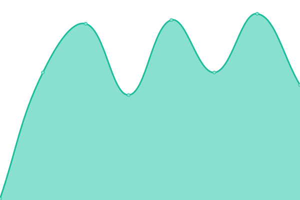 103ms
     
 | 

<a href="https://freehostinguptime.tinkerhost.net/history/h130">75.63%</a>
    

|  H131 | 🟩 Up | [h131.yml](https://github.com/TinkerHost/upptime-free-hosting-servers/commits/HEAD/history/h131.yml) | 

 116ms
     
 | 

<a href="https://freehostinguptime.tinkerhost.net/history/h131">77.05%</a>
    

|  H132 | 🟩 Up | [h132.yml](https://github.com/TinkerHost/upptime-free-hosting-servers/commits/HEAD/history/h132.yml) | 

 104ms
     
 | 

<a href="https://freehostinguptime.tinkerhost.net/history/h132">77.24%</a>
    

|  H133 | 🟩 Up | [h133.yml](https://github.com/TinkerHost/upptime-free-hosting-servers/commits/HEAD/history/h133.yml) | 

 114ms
     
 | 

<a href="https://freehostinguptime.tinkerhost.net/history/h133">77.00%</a>
    

|  H139 | 🟩 Up | [h139.yml](https://github.com/TinkerHost/upptime-free-hosting-servers/commits/HEAD/history/h139.yml) | 

 104ms
     
 | 

<a href="https://freehostinguptime.tinkerhost.net/history/h139">76.43%</a>
    

|  H140 | 🟩 Up | [h140.yml](https://github.com/TinkerHost/upptime-free-hosting-servers/commits/HEAD/history/h140.yml) | 

 103ms
     
 | 

<a href="https://freehostinguptime.tinkerhost.net/history/h140">76.64%</a>
    

|  H142 | 🟩 Up | [h142.yml](https://github.com/TinkerHost/upptime-free-hosting-servers/commits/HEAD/history/h142.yml) | 

 104ms
     
 | 

<a href="https://freehostinguptime.tinkerhost.net/history/h142">76.85%</a>
    

|  H143 | 🟩 Up | [h143.yml](https://github.com/TinkerHost/upptime-free-hosting-servers/commits/HEAD/history/h143.yml) | 

 104ms
     
 | 

<a href="https://freehostinguptime.tinkerhost.net/history/h143">78.21%</a>
    

|  H144 | 🟩 Up | [h144.yml](https://github.com/TinkerHost/upptime-free-hosting-servers/commits/HEAD/history/h144.yml) | 

 104ms
     
 | 

<a href="https://freehostinguptime.tinkerhost.net/history/h144">78.41%</a>
    

|  H149 | 🟩 Up | [h149.yml](https://github.com/TinkerHost/upptime-free-hosting-servers/commits/HEAD/history/h149.yml) | 

 104ms
     
 | 

<a href="https://freehostinguptime.tinkerhost.net/history/h149">78.71%</a>
    

|  H150 | 🟩 Up | [h150.yml](https://github.com/TinkerHost/upptime-free-hosting-servers/commits/HEAD/history/h150.yml) | 

 104ms
     
 | 

<a href="https://freehostinguptime.tinkerhost.net/history/h150">77.67%</a>
    

|  H151 | 🟩 Up | [h151.yml](https://github.com/TinkerHost/upptime-free-hosting-servers/commits/HEAD/history/h151.yml) | 

 103ms
     
 | 

<a href="https://freehostinguptime.tinkerhost.net/history/h151">77.88%</a>
    

|  H176 | 🟩 Up | [h176.yml](https://github.com/TinkerHost/upptime-free-hosting-servers/commits/HEAD/history/h176.yml) | 

 104ms
     
 | 

<a href="https://freehostinguptime.tinkerhost.net/history/h176">79.22%</a>
    

|  H202 | 🟩 Up | [h202.yml](https://github.com/TinkerHost/upptime-free-hosting-servers/commits/HEAD/history/h202.yml) | 

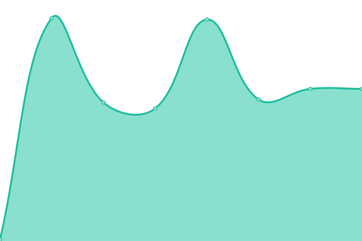 113ms
     
 | 

<a href="https://freehostinguptime.tinkerhost.net/history/h202">78.29%</a>
    

|  H214 | 🟩 Up | [h214.yml](https://github.com/TinkerHost/upptime-free-hosting-servers/commits/HEAD/history/h214.yml) | 

 114ms
     
 | 

<a href="https://freehostinguptime.tinkerhost.net/history/h214">78.50%</a>
    

|  H215 | 🟩 Up | [h215.yml](https://github.com/TinkerHost/upptime-free-hosting-servers/commits/HEAD/history/h215.yml) | 

 104ms
     
 | 

<a href="https://freehostinguptime.tinkerhost.net/history/h215">79.93%</a>
    

|  H217 | 🟩 Up | [h217.yml](https://github.com/TinkerHost/upptime-free-hosting-servers/commits/HEAD/history/h217.yml) | 

 114ms
     
 | 

<a href="https://freehostinguptime.tinkerhost.net/history/h217">78.90%</a>
    

|  H218 | 🟩 Up | [h218.yml](https://github.com/TinkerHost/upptime-free-hosting-servers/commits/HEAD/history/h218.yml) | 

 103ms
     
 | 

<a href="https://freehostinguptime.tinkerhost.net/history/h218">81.04%</a>
    

|  H219 | 🟩 Up | [h219.yml](https://github.com/TinkerHost/upptime-free-hosting-servers/commits/HEAD/history/h219.yml) | 

 102ms
     
 | 

<a href="https://freehostinguptime.tinkerhost.net/history/h219">80.94%</a>
    

|  H221 | 🟩 Up | [h221.yml](https://github.com/TinkerHost/upptime-free-hosting-servers/commits/HEAD/history/h221.yml) | 

 102ms
     
 | 

<a href="https://freehostinguptime.tinkerhost.net/history/h221">81.74%</a>
    

|  H222 | 🟩 Up | [h222.yml](https://github.com/TinkerHost/upptime-free-hosting-servers/commits/HEAD/history/h222.yml) | 

 104ms
     
 | 

<a href="https://freehostinguptime.tinkerhost.net/history/h222">80.87%</a>
    

|  H223 | 🟩 Up | [h223.yml](https://github.com/TinkerHost/upptime-free-hosting-servers/commits/HEAD/history/h223.yml) | 

 103ms
     
 | 

<a href="https://freehostinguptime.tinkerhost.net/history/h223">79.89%</a>
    

|  H224 | 🟩 Up | [h224.yml](https://github.com/TinkerHost/upptime-free-hosting-servers/commits/HEAD/history/h224.yml) | 

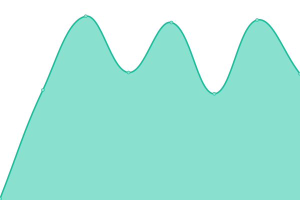 104ms
     
 | 

<a href="https://freehostinguptime.tinkerhost.net/history/h224">80.95%</a>
    

|  H232 | 🟩 Up | [h232.yml](https://github.com/TinkerHost/upptime-free-hosting-servers/commits/HEAD/history/h232.yml) | 

 114ms
     
 | 

<a href="https://freehostinguptime.tinkerhost.net/history/h232">80.31%</a>
    

|  H33 | 🟩 Up | [h33.yml](https://github.com/TinkerHost/upptime-free-hosting-servers/commits/HEAD/history/h33.yml) | 

 114ms
     
 | 

<a href="https://freehostinguptime.tinkerhost.net/history/h33">81.56%</a>
    

|  H34 | 🟩 Up | [h34.yml](https://github.com/TinkerHost/upptime-free-hosting-servers/commits/HEAD/history/h34.yml) | 

 104ms
     
 | 

<a href="https://freehostinguptime.tinkerhost.net/history/h34">77.99%</a>
    

|  H36 | 🟩 Up | [h36.yml](https://github.com/TinkerHost/upptime-free-hosting-servers/commits/HEAD/history/h36.yml) | 

 103ms
     
 | 

<a href="https://freehostinguptime.tinkerhost.net/history/h36">76.50%</a>
    

|  H37 | 🟩 Up | [h37.yml](https://github.com/TinkerHost/upptime-free-hosting-servers/commits/HEAD/history/h37.yml) | 

 103ms
     
 | 

<a href="https://freehostinguptime.tinkerhost.net/history/h37">76.71%</a>
    

|  H38 | 🟩 Up | [h38.yml](https://github.com/TinkerHost/upptime-free-hosting-servers/commits/HEAD/history/h38.yml) | 

 103ms
     
 | 

<a href="https://freehostinguptime.tinkerhost.net/history/h38">76.92%</a>
    

|  H39 | 🟩 Up | [h39.yml](https://github.com/TinkerHost/upptime-free-hosting-servers/commits/HEAD/history/h39.yml) | 

 104ms
     
 | 

<a href="https://freehostinguptime.tinkerhost.net/history/h39">77.13%</a>
    

|  H40 | 🟩 Up | [h40.yml](https://github.com/TinkerHost/upptime-free-hosting-servers/commits/HEAD/history/h40.yml) | 

 103ms
     
 | 

<a href="https://freehostinguptime.tinkerhost.net/history/h40">79.17%</a>
    

|  H41 | 🟩 Up | [h41.yml](https://github.com/TinkerHost/upptime-free-hosting-servers/commits/HEAD/history/h41.yml) | 

 103ms
     
 | 

<a href="https://freehostinguptime.tinkerhost.net/history/h41">77.54%</a>
    

|  H42 | 🟩 Up | [h42.yml](https://github.com/TinkerHost/upptime-free-hosting-servers/commits/HEAD/history/h42.yml) | 

 104ms
     
 | 

<a href="https://freehostinguptime.tinkerhost.net/history/h42">77.75%</a>
    

|  H43 | 🟩 Up | [h43.yml](https://github.com/TinkerHost/upptime-free-hosting-servers/commits/HEAD/history/h43.yml) | 

 126ms
     
 | 

<a href="https://freehostinguptime.tinkerhost.net/history/h43">77.96%</a>
    

|  H44 | 🟩 Up | [h44.yml](https://github.com/TinkerHost/upptime-free-hosting-servers/commits/HEAD/history/h44.yml) | 

 104ms
     
 | 

<a href="https://freehostinguptime.tinkerhost.net/history/h44">73.27%</a>
    

|  H45 | 🟩 Up | [h45.yml](https://github.com/TinkerHost/upptime-free-hosting-servers/commits/HEAD/history/h45.yml) | 

 124ms
     
 | 

<a href="https://freehostinguptime.tinkerhost.net/history/h45">78.37%</a>
    

|  H46 | 🟩 Up | [h46.yml](https://github.com/TinkerHost/upptime-free-hosting-servers/commits/HEAD/history/h46.yml) | 

 103ms
     
 | 

<a href="https://freehostinguptime.tinkerhost.net/history/h46">77.03%</a>
    

|  H47 | 🟩 Up | [h47.yml](https://github.com/TinkerHost/upptime-free-hosting-servers/commits/HEAD/history/h47.yml) | 

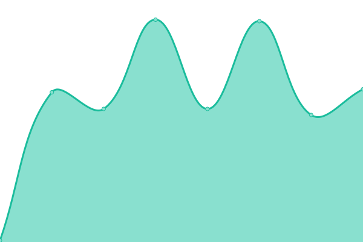 124ms
     
 | 

<a href="https://freehostinguptime.tinkerhost.net/history/h47">83.17%</a>
    

|  H50 | 🟩 Up | [h50.yml](https://github.com/TinkerHost/upptime-free-hosting-servers/commits/HEAD/history/h50.yml) | 

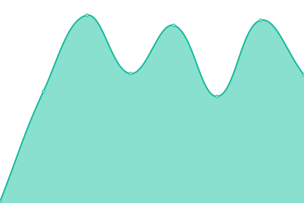 113ms
     
 | 

<a href="https://freehostinguptime.tinkerhost.net/history/h50">83.38%</a>
    

|  H55 | 🟩 Up | [h55.yml](https://github.com/TinkerHost/upptime-free-hosting-servers/commits/HEAD/history/h55.yml) | 

 133ms
     
 | 

<a href="https://freehostinguptime.tinkerhost.net/history/h55">84.37%</a>
    

|  H57 | 🟩 Up | [h57.yml](https://github.com/TinkerHost/upptime-free-hosting-servers/commits/HEAD/history/h57.yml) | 

 123ms
     
 | 

<a href="https://freehostinguptime.tinkerhost.net/history/h57">85.20%</a>
    

|  H59 | 🟩 Up | [h59.yml](https://github.com/TinkerHost/upptime-free-hosting-servers/commits/HEAD/history/h59.yml) | 

 103ms
     
 | 

<a href="https://freehostinguptime.tinkerhost.net/history/h59">83.97%</a>
    

|  H60 | 🟩 Up | [h60.yml](https://github.com/TinkerHost/upptime-free-hosting-servers/commits/HEAD/history/h60.yml) | 

 103ms
     
 | 

<a href="https://freehostinguptime.tinkerhost.net/history/h60">83.71%</a>
    

|  H65 | 🟩 Up | [h65.yml](https://github.com/TinkerHost/upptime-free-hosting-servers/commits/HEAD/history/h65.yml) | 

 105ms
     
 | 

<a href="https://freehostinguptime.tinkerhost.net/history/h65">85.68%</a>
    

|  H98 | 🟩 Up | [h98.yml](https://github.com/TinkerHost/upptime-free-hosting-servers/commits/HEAD/history/h98.yml) | 

 106ms
     
 | 

<a href="https://freehostinguptime.tinkerhost.net/history/h98">83.89%</a>
    

|  T100 | 🟩 Up | [t100.yml](https://github.com/TinkerHost/upptime-free-hosting-servers/commits/HEAD/history/t100.yml) | 

 105ms
     
 | 

<a href="https://freehostinguptime.tinkerhost.net/history/t100">87.36%</a>
    

|  T102 | 🟩 Up | [t102.yml](https://github.com/TinkerHost/upptime-free-hosting-servers/commits/HEAD/history/t102.yml) | 

 103ms
     
 | 

<a href="https://freehostinguptime.tinkerhost.net/history/t102">82.19%</a>
    

|  T103 | 🟩 Up | [t103.yml](https://github.com/TinkerHost/upptime-free-hosting-servers/commits/HEAD/history/t103.yml) | 

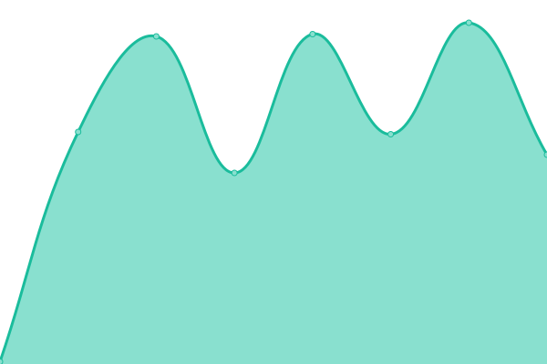 104ms
     
 | 

<a href="https://freehostinguptime.tinkerhost.net/history/t103">83.05%</a>
    

|  T104 | 🟩 Up | [t104.yml](https://github.com/TinkerHost/upptime-free-hosting-servers/commits/HEAD/history/t104.yml) | 

 103ms
     
 | 

<a href="https://freehostinguptime.tinkerhost.net/history/t104">79.02%</a>
    

|  T105 | 🟩 Up | [t105.yml](https://github.com/TinkerHost/upptime-free-hosting-servers/commits/HEAD/history/t105.yml) | 

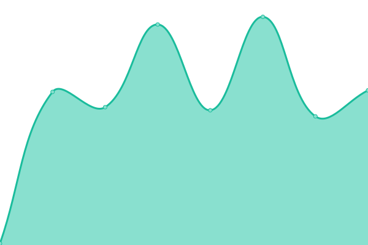 104ms
     
 | 

<a href="https://freehostinguptime.tinkerhost.net/history/t105">80.03%</a>
    

|  T106 | 🟩 Up | [t106.yml](https://github.com/TinkerHost/upptime-free-hosting-servers/commits/HEAD/history/t106.yml) | 

 104ms
     
 | 

<a href="https://freehostinguptime.tinkerhost.net/history/t106">82.19%</a>
    

|  T107 | 🟩 Up | [t107.yml](https://github.com/TinkerHost/upptime-free-hosting-servers/commits/HEAD/history/t107.yml) | 

 104ms
     
 | 

<a href="https://freehostinguptime.tinkerhost.net/history/t107">81.57%</a>
    

|  T108 | 🟩 Up | [t108.yml](https://github.com/TinkerHost/upptime-free-hosting-servers/commits/HEAD/history/t108.yml) | 

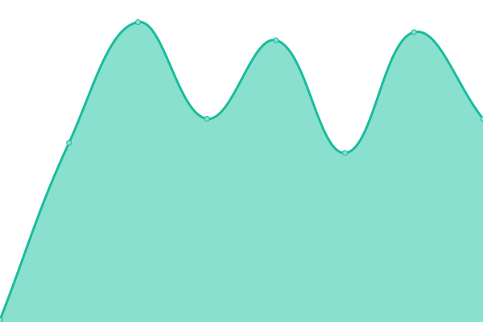 103ms
     
 | 

<a href="https://freehostinguptime.tinkerhost.net/history/t108">81.78%</a>
    

|  T109 | 🟩 Up | [t109.yml](https://github.com/TinkerHost/upptime-free-hosting-servers/commits/HEAD/history/t109.yml) | 

 114ms
     
 | 

<a href="https://freehostinguptime.tinkerhost.net/history/t109">81.99%</a>
    

|  T110 | 🟩 Up | [t110.yml](https://github.com/TinkerHost/upptime-free-hosting-servers/commits/HEAD/history/t110.yml) | 

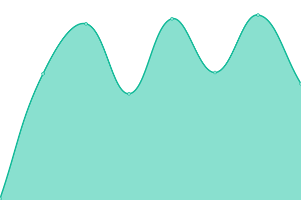 103ms
     
 | 

<a href="https://freehostinguptime.tinkerhost.net/history/t110">82.20%</a>
    

|  T111 | 🟩 Up | [t111.yml](https://github.com/TinkerHost/upptime-free-hosting-servers/commits/HEAD/history/t111.yml) | 

 104ms
     
 | 

<a href="https://freehostinguptime.tinkerhost.net/history/t111">82.99%</a>
    

|  T112 | 🟩 Up | [t112.yml](https://github.com/TinkerHost/upptime-free-hosting-servers/commits/HEAD/history/t112.yml) | 

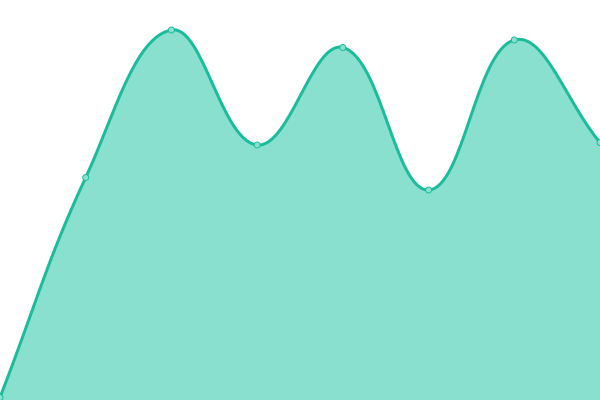 114ms
     
 | 

<a href="https://freehostinguptime.tinkerhost.net/history/t112">82.60%</a>
    

|  T114 | 🟩 Up | [t114.yml](https://github.com/TinkerHost/upptime-free-hosting-servers/commits/HEAD/history/t114.yml) | 

 104ms
     
 | 

<a href="https://freehostinguptime.tinkerhost.net/history/t114">82.81%</a>
    

|  T116 | 🟩 Up | [t116.yml](https://github.com/TinkerHost/upptime-free-hosting-servers/commits/HEAD/history/t116.yml) | 

 104ms
     
 | 

<a href="https://freehostinguptime.tinkerhost.net/history/t116">83.02%</a>
    

|  T117 | 🟩 Up | [t117.yml](https://github.com/TinkerHost/upptime-free-hosting-servers/commits/HEAD/history/t117.yml) | 

 114ms
     
 | 

<a href="https://freehostinguptime.tinkerhost.net/history/t117">83.23%</a>
    

|  T118 | 🟩 Up | [t118.yml](https://github.com/TinkerHost/upptime-free-hosting-servers/commits/HEAD/history/t118.yml) | 

 103ms
     
 | 

<a href="https://freehostinguptime.tinkerhost.net/history/t118">83.44%</a>
    

|  T120 | 🟩 Up | [t120.yml](https://github.com/TinkerHost/upptime-free-hosting-servers/commits/HEAD/history/t120.yml) | 

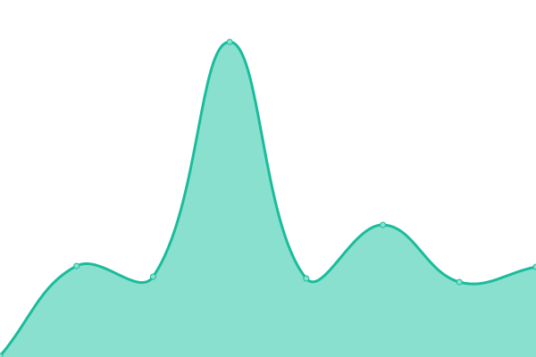 103ms
     
 | 

<a href="https://freehostinguptime.tinkerhost.net/history/t120">83.65%</a>
    

|  T124 | 🟩 Up | [t124.yml](https://github.com/TinkerHost/upptime-free-hosting-servers/commits/HEAD/history/t124.yml) | 

 104ms
     
 | 

<a href="https://freehostinguptime.tinkerhost.net/history/t124">83.86%</a>
    

|  T125 | 🟩 Up | [t125.yml](https://github.com/TinkerHost/upptime-free-hosting-servers/commits/HEAD/history/t125.yml) | 

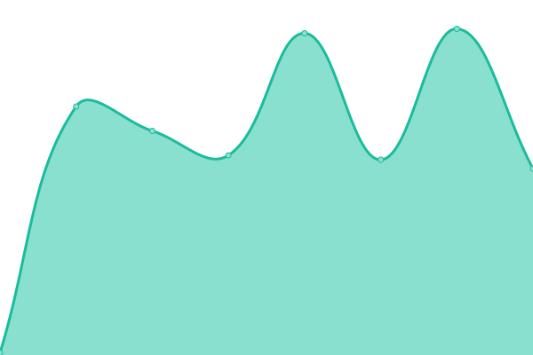 104ms
     
 | 

<a href="https://freehostinguptime.tinkerhost.net/history/t125">84.06%</a>
    

|  T127 | 🟩 Up | [t127.yml](https://github.com/TinkerHost/upptime-free-hosting-servers/commits/HEAD/history/t127.yml) | 

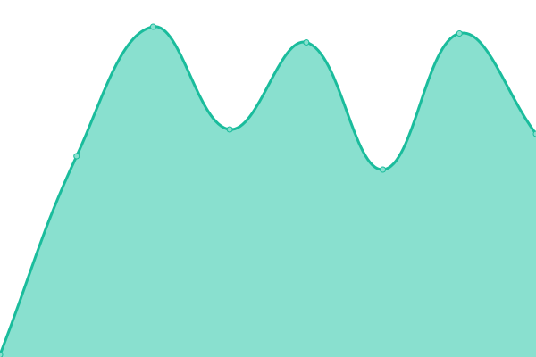 104ms
     
 | 

<a href="https://freehostinguptime.tinkerhost.net/history/t127">84.27%</a>
    

|  T128 | 🟩 Up | [t128.yml](https://github.com/TinkerHost/upptime-free-hosting-servers/commits/HEAD/history/t128.yml) | 

 103ms
     
 | 

<a href="https://freehostinguptime.tinkerhost.net/history/t128">78.84%</a>
    

|  T134 | 🟩 Up | [t134.yml](https://github.com/TinkerHost/upptime-free-hosting-servers/commits/HEAD/history/t134.yml) | 

 102ms
     
 | 

<a href="https://freehostinguptime.tinkerhost.net/history/t134">85.16%</a>
    

|  T135 | 🟩 Up | [t135.yml](https://github.com/TinkerHost/upptime-free-hosting-servers/commits/HEAD/history/t135.yml) | 

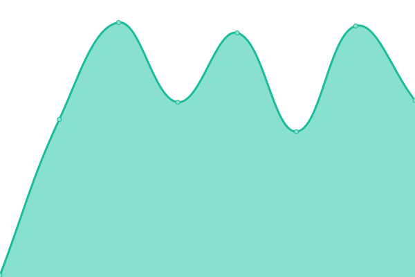 104ms
     
 | 

<a href="https://freehostinguptime.tinkerhost.net/history/t135">84.88%</a>
    

|  T136 | 🟩 Up | [t136.yml](https://github.com/TinkerHost/upptime-free-hosting-servers/commits/HEAD/history/t136.yml) | 

 103ms
     
 | 

<a href="https://freehostinguptime.tinkerhost.net/history/t136">85.09%</a>
    

|  T137 | 🟩 Up | [t137.yml](https://github.com/TinkerHost/upptime-free-hosting-servers/commits/HEAD/history/t137.yml) | 

 114ms
     
 | 

<a href="https://freehostinguptime.tinkerhost.net/history/t137">85.29%</a>
    

|  T138 | 🟩 Up | [t138.yml](https://github.com/TinkerHost/upptime-free-hosting-servers/commits/HEAD/history/t138.yml) | 

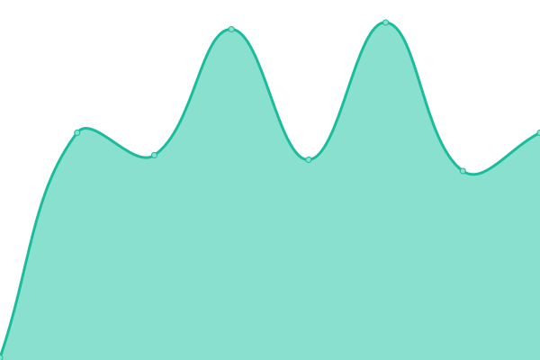 103ms
     
 | 

<a href="https://freehostinguptime.tinkerhost.net/history/t138">82.62%</a>
    

|  T145 | 🟩 Up | [t145.yml](https://github.com/TinkerHost/upptime-free-hosting-servers/commits/HEAD/history/t145.yml) | 

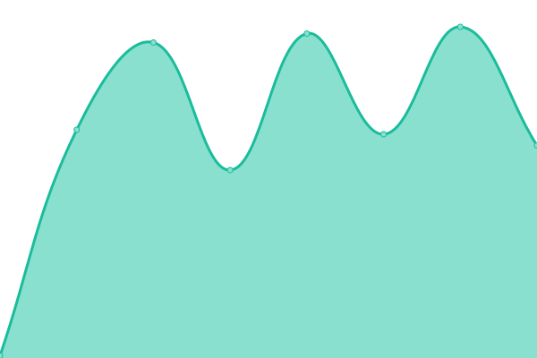 104ms
     
 | 

<a href="https://freehostinguptime.tinkerhost.net/history/t145">82.82%</a>
    

|  T146 | 🟩 Up | [t146.yml](https://github.com/TinkerHost/upptime-free-hosting-servers/commits/HEAD/history/t146.yml) | 

 104ms
     
 | 

<a href="https://freehostinguptime.tinkerhost.net/history/t146">83.01%</a>
    

|  T147 | 🟩 Up | [t147.yml](https://github.com/TinkerHost/upptime-free-hosting-servers/commits/HEAD/history/t147.yml) | 

 104ms
     
 | 

<a href="https://freehostinguptime.tinkerhost.net/history/t147">73.57%</a>
    

|  T148 | 🟩 Up | [t148.yml](https://github.com/TinkerHost/upptime-free-hosting-servers/commits/HEAD/history/t148.yml) | 

 102ms
     
 | 

<a href="https://freehostinguptime.tinkerhost.net/history/t148">79.87%</a>
    

|  T153 | 🟩 Up | [t153.yml](https://github.com/TinkerHost/upptime-free-hosting-servers/commits/HEAD/history/t153.yml) | 

 104ms
     
 | 

<a href="https://freehostinguptime.tinkerhost.net/history/t153">87.99%</a>
    

|  T154 | 🟩 Up | [t154.yml](https://github.com/TinkerHost/upptime-free-hosting-servers/commits/HEAD/history/t154.yml) | 

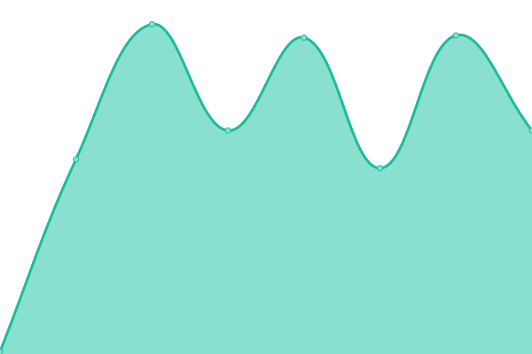 104ms
     
 | 

<a href="https://freehostinguptime.tinkerhost.net/history/t154">88.19%</a>
    

|  T155 | 🟩 Up | [t155.yml](https://github.com/TinkerHost/upptime-free-hosting-servers/commits/HEAD/history/t155.yml) | 

 103ms
     
 | 

<a href="https://freehostinguptime.tinkerhost.net/history/t155">83.98%</a>
    

|  T160 | 🟩 Up | [t160.yml](https://github.com/TinkerHost/upptime-free-hosting-servers/commits/HEAD/history/t160.yml) | 

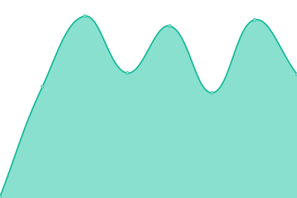 114ms
     
 | 

<a href="https://freehostinguptime.tinkerhost.net/history/t160">85.40%</a>
    

|  T162 | 🟩 Up | [t162.yml](https://github.com/TinkerHost/upptime-free-hosting-servers/commits/HEAD/history/t162.yml) | 

 103ms
     
 | 

<a href="https://freehostinguptime.tinkerhost.net/history/t162">84.37%</a>
    

|  T163 | 🟩 Up | [t163.yml](https://github.com/TinkerHost/upptime-free-hosting-servers/commits/HEAD/history/t163.yml) | 

 104ms
     
 | 

<a href="https://freehostinguptime.tinkerhost.net/history/t163">84.56%</a>
    

|  T164 | 🟩 Up | [t164.yml](https://github.com/TinkerHost/upptime-free-hosting-servers/commits/HEAD/history/t164.yml) | 

 103ms
     
 | 

<a href="https://freehostinguptime.tinkerhost.net/history/t164">81.27%</a>
    

|  T165 | 🟩 Up | [t165.yml](https://github.com/TinkerHost/upptime-free-hosting-servers/commits/HEAD/history/t165.yml) | 

 113ms
     
 | 

<a href="https://freehostinguptime.tinkerhost.net/history/t165">85.23%</a>
    

|  T166 | 🟩 Up | [t166.yml](https://github.com/TinkerHost/upptime-free-hosting-servers/commits/HEAD/history/t166.yml) | 

 105ms
     
 | 

<a href="https://freehostinguptime.tinkerhost.net/history/t166">85.66%</a>
    

|  T167 | 🟩 Up | [t167.yml](https://github.com/TinkerHost/upptime-free-hosting-servers/commits/HEAD/history/t167.yml) | 

 106ms
     
 | 

<a href="https://freehostinguptime.tinkerhost.net/history/t167">86.06%</a>
    

|  T170 | 🟩 Up | [t170.yml](https://github.com/TinkerHost/upptime-free-hosting-servers/commits/HEAD/history/t170.yml) | 

 102ms
     
 | 

<a href="https://freehostinguptime.tinkerhost.net/history/t170">83.49%</a>
    

|  T171 | 🟩 Up | [t171.yml](https://github.com/TinkerHost/upptime-free-hosting-servers/commits/HEAD/history/t171.yml) | 

 114ms
     
 | 

<a href="https://freehostinguptime.tinkerhost.net/history/t171">86.30%</a>
    

|  T172 | 🟩 Up | [t172.yml](https://github.com/TinkerHost/upptime-free-hosting-servers/commits/HEAD/history/t172.yml) | 

 102ms
     
 | 

<a href="https://freehostinguptime.tinkerhost.net/history/t172">86.46%</a>
    

|  T174 | 🟩 Up | [t174.yml](https://github.com/TinkerHost/upptime-free-hosting-servers/commits/HEAD/history/t174.yml) | 

 104ms
     
 | 

<a href="https://freehostinguptime.tinkerhost.net/history/t174">86.37%</a>
    

<!--end: status pages-->

[**Visit our status website →**](https://freehostinguptime.tinkerhost.net)

## 📄 License

- Powered by: [Upptime](https://github.com/upptime/upptime)
- Code: [MIT](./LICENSE) © [Anand Chowdhary](https://anandchowdhary.com), supported by [Pabio](https://pabio.com)
- Data in the `./history` directory: [Open Database License](https://opendatacommons.org/licenses/odbl/1-0/)
