# [📈 Live Status](https://freehostinguptime.tinkerhost.net): <!--live status--> **🟧 Partial outage**

This repository contains the open-source uptime monitor and status page for [TinkerHost](https://tinkerhost.net), powered by [Upptime](https://github.com/upptime/upptime).

With [Upptime](https://upptime.js.org), you can get your own unlimited and free uptime monitor and status page, powered entirely by a GitHub repository. We use [Issues](https://github.com/TinkerHost/upptime-free-hosting-servers/issues) as incident reports, [Actions](https://github.com/TinkerHost/upptime-free-hosting-servers/actions) as uptime monitors, and [Pages](https://freehostinguptime.tinkerhost.net) for the status page.

<!--start: status pages-->
<!-- This summary is generated by Upptime (https://github.com/upptime/upptime) -->
<!-- Do not edit this manually, your changes will be overwritten -->
<!-- prettier-ignore -->
| URL | Status | History | Response Time | Uptime |
| --- | ------ | ------- | ------------- | ------ |
|  B183 | 🟥 Down | [b183.yml](https://github.com/TinkerHost/upptime-free-hosting-servers/commits/HEAD/history/b183.yml) | 

 118ms
     
 | 

<a href="https://freehostinguptime.tinkerhost.net/history/b183">62.56%</a>
    

|  A185 | 🟥 Down | [a185.yml](https://github.com/TinkerHost/upptime-free-hosting-servers/commits/HEAD/history/a185.yml) | 

 110ms
     
 | 

<a href="https://freehostinguptime.tinkerhost.net/history/a185">62.83%</a>
    

|  H101 | 🟥 Down | [h101.yml](https://github.com/TinkerHost/upptime-free-hosting-servers/commits/HEAD/history/h101.yml) | 

 110ms
     
 | 

<a href="https://freehostinguptime.tinkerhost.net/history/h101">62.73%</a>
    

|  H113 | 🟥 Down | [h113.yml](https://github.com/TinkerHost/upptime-free-hosting-servers/commits/HEAD/history/h113.yml) | 

 110ms
     
 | 

<a href="https://freehostinguptime.tinkerhost.net/history/h113">63.36%</a>
    

|  H115 | 🟥 Down | [h115.yml](https://github.com/TinkerHost/upptime-free-hosting-servers/commits/HEAD/history/h115.yml) | 

 110ms
     
 | 

<a href="https://freehostinguptime.tinkerhost.net/history/h115">63.63%</a>
    

|  H126 | 🟥 Down | [h126.yml](https://github.com/TinkerHost/upptime-free-hosting-servers/commits/HEAD/history/h126.yml) | 

 111ms
     
 | 

<a href="https://freehostinguptime.tinkerhost.net/history/h126">65.12%</a>
    

|  H129 | 🟥 Down | [h129.yml](https://github.com/TinkerHost/upptime-free-hosting-servers/commits/HEAD/history/h129.yml) | 

 110ms
     
 | 

<a href="https://freehostinguptime.tinkerhost.net/history/h129">65.64%</a>
    

|  H130 | 🟥 Down | [h130.yml](https://github.com/TinkerHost/upptime-free-hosting-servers/commits/HEAD/history/h130.yml) | 

 110ms
     
 | 

<a href="https://freehostinguptime.tinkerhost.net/history/h130">65.89%</a>
    

|  H131 | 🟥 Down | [h131.yml](https://github.com/TinkerHost/upptime-free-hosting-servers/commits/HEAD/history/h131.yml) | 

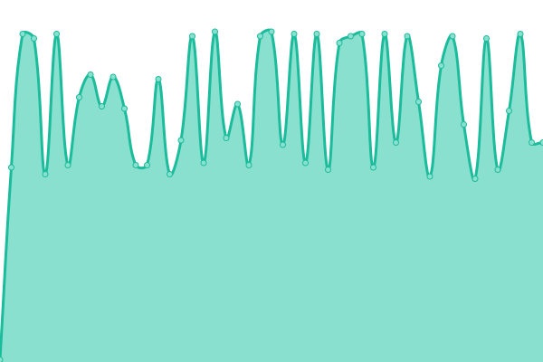 119ms
     
 | 

<a href="https://freehostinguptime.tinkerhost.net/history/h131">65.83%</a>
    

|  H132 | 🟥 Down | [h132.yml](https://github.com/TinkerHost/upptime-free-hosting-servers/commits/HEAD/history/h132.yml) | 

 111ms
     
 | 

<a href="https://freehostinguptime.tinkerhost.net/history/h132">66.08%</a>
    

|  H133 | 🟥 Down | [h133.yml](https://github.com/TinkerHost/upptime-free-hosting-servers/commits/HEAD/history/h133.yml) | 

 110ms
     
 | 

<a href="https://freehostinguptime.tinkerhost.net/history/h133">65.22%</a>
    

|  H139 | 🟥 Down | [h139.yml](https://github.com/TinkerHost/upptime-free-hosting-servers/commits/HEAD/history/h139.yml) | 

 110ms
     
 | 

<a href="https://freehostinguptime.tinkerhost.net/history/h139">65.49%</a>
    

|  H140 | 🟥 Down | [h140.yml](https://github.com/TinkerHost/upptime-free-hosting-servers/commits/HEAD/history/h140.yml) | 

 109ms
     
 | 

<a href="https://freehostinguptime.tinkerhost.net/history/h140">63.94%</a>
    

|  H142 | 🟥 Down | [h142.yml](https://github.com/TinkerHost/upptime-free-hosting-servers/commits/HEAD/history/h142.yml) | 

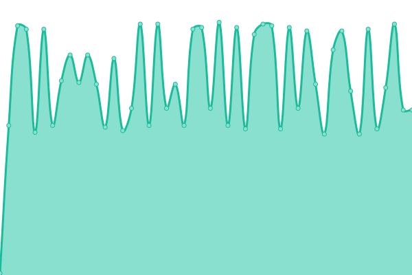 118ms
     
 | 

<a href="https://freehostinguptime.tinkerhost.net/history/h142">66.01%</a>
    

|  H143 | 🟥 Down | [h143.yml](https://github.com/TinkerHost/upptime-free-hosting-servers/commits/HEAD/history/h143.yml) | 

 110ms
     
 | 

<a href="https://freehostinguptime.tinkerhost.net/history/h143">66.28%</a>
    

|  H144 | 🟥 Down | [h144.yml](https://github.com/TinkerHost/upptime-free-hosting-servers/commits/HEAD/history/h144.yml) | 

 109ms
     
 | 

<a href="https://freehostinguptime.tinkerhost.net/history/h144">67.75%</a>
    

|  H149 | 🟥 Down | [h149.yml](https://github.com/TinkerHost/upptime-free-hosting-servers/commits/HEAD/history/h149.yml) | 

 109ms
     
 | 

<a href="https://freehostinguptime.tinkerhost.net/history/h149">66.29%</a>
    

|  H150 | 🟥 Down | [h150.yml](https://github.com/TinkerHost/upptime-free-hosting-servers/commits/HEAD/history/h150.yml) | 

 109ms
     
 | 

<a href="https://freehostinguptime.tinkerhost.net/history/h150">65.77%</a>
    

|  H151 | 🟥 Down | [h151.yml](https://github.com/TinkerHost/upptime-free-hosting-servers/commits/HEAD/history/h151.yml) | 

 110ms
     
 | 

<a href="https://freehostinguptime.tinkerhost.net/history/h151">62.48%</a>
    

|  H176 | 🟥 Down | [h176.yml](https://github.com/TinkerHost/upptime-free-hosting-servers/commits/HEAD/history/h176.yml) | 

 118ms
     
 | 

<a href="https://freehostinguptime.tinkerhost.net/history/h176">62.75%</a>
    

|  H202 | 🟥 Down | [h202.yml](https://github.com/TinkerHost/upptime-free-hosting-servers/commits/HEAD/history/h202.yml) | 

 110ms
     
 | 

<a href="https://freehostinguptime.tinkerhost.net/history/h202">63.02%</a>
    

|  H214 | 🟥 Down | [h214.yml](https://github.com/TinkerHost/upptime-free-hosting-servers/commits/HEAD/history/h214.yml) | 

 110ms
     
 | 

<a href="https://freehostinguptime.tinkerhost.net/history/h214">63.29%</a>
    

|  H215 | 🟥 Down | [h215.yml](https://github.com/TinkerHost/upptime-free-hosting-servers/commits/HEAD/history/h215.yml) | 

 110ms
     
 | 

<a href="https://freehostinguptime.tinkerhost.net/history/h215">63.56%</a>
    

|  H217 | 🟥 Down | [h217.yml](https://github.com/TinkerHost/upptime-free-hosting-servers/commits/HEAD/history/h217.yml) | 

 110ms
     
 | 

<a href="https://freehostinguptime.tinkerhost.net/history/h217">63.83%</a>
    

|  H218 | 🟥 Down | [h218.yml](https://github.com/TinkerHost/upptime-free-hosting-servers/commits/HEAD/history/h218.yml) | 

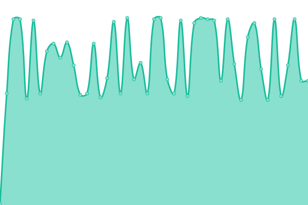 126ms
     
 | 

<a href="https://freehostinguptime.tinkerhost.net/history/h218">64.10%</a>
    

|  H219 | 🟥 Down | [h219.yml](https://github.com/TinkerHost/upptime-free-hosting-servers/commits/HEAD/history/h219.yml) | 

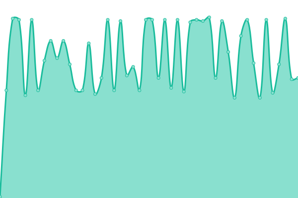 111ms
     
 | 

<a href="https://freehostinguptime.tinkerhost.net/history/h219">64.55%</a>
    

|  H221 | 🟥 Down | [h221.yml](https://github.com/TinkerHost/upptime-free-hosting-servers/commits/HEAD/history/h221.yml) | 

 108ms
     
 | 

<a href="https://freehostinguptime.tinkerhost.net/history/h221">62.85%</a>
    

|  H222 | 🟥 Down | [h222.yml](https://github.com/TinkerHost/upptime-free-hosting-servers/commits/HEAD/history/h222.yml) | 

 110ms
     
 | 

<a href="https://freehostinguptime.tinkerhost.net/history/h222">63.92%</a>
    

|  H223 | 🟥 Down | [h223.yml](https://github.com/TinkerHost/upptime-free-hosting-servers/commits/HEAD/history/h223.yml) | 

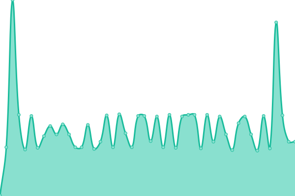 118ms
     
 | 

<a href="https://freehostinguptime.tinkerhost.net/history/h223">64.20%</a>
    

|  H224 | 🟥 Down | [h224.yml](https://github.com/TinkerHost/upptime-free-hosting-servers/commits/HEAD/history/h224.yml) | 

 110ms
     
 | 

<a href="https://freehostinguptime.tinkerhost.net/history/h224">64.48%</a>
    

|  H232 | 🟥 Down | [h232.yml](https://github.com/TinkerHost/upptime-free-hosting-servers/commits/HEAD/history/h232.yml) | 

 110ms
     
 | 

<a href="https://freehostinguptime.tinkerhost.net/history/h232">64.76%</a>
    

|  H33 | 🟥 Down | [h33.yml](https://github.com/TinkerHost/upptime-free-hosting-servers/commits/HEAD/history/h33.yml) | 

 110ms
     
 | 

<a href="https://freehostinguptime.tinkerhost.net/history/h33">65.90%</a>
    

|  H34 | 🟥 Down | [h34.yml](https://github.com/TinkerHost/upptime-free-hosting-servers/commits/HEAD/history/h34.yml) | 

 109ms
     
 | 

<a href="https://freehostinguptime.tinkerhost.net/history/h34">64.76%</a>
    

|  H36 | 🟥 Down | [h36.yml](https://github.com/TinkerHost/upptime-free-hosting-servers/commits/HEAD/history/h36.yml) | 

 110ms
     
 | 

<a href="https://freehostinguptime.tinkerhost.net/history/h36">64.17%</a>
    

|  H37 | 🟥 Down | [h37.yml](https://github.com/TinkerHost/upptime-free-hosting-servers/commits/HEAD/history/h37.yml) | 

 111ms
     
 | 

<a href="https://freehostinguptime.tinkerhost.net/history/h37">64.34%</a>
    

|  H38 | 🟥 Down | [h38.yml](https://github.com/TinkerHost/upptime-free-hosting-servers/commits/HEAD/history/h38.yml) | 

 110ms
     
 | 

<a href="https://freehostinguptime.tinkerhost.net/history/h38">65.46%</a>
    

|  H39 | 🟥 Down | [h39.yml](https://github.com/TinkerHost/upptime-free-hosting-servers/commits/HEAD/history/h39.yml) | 

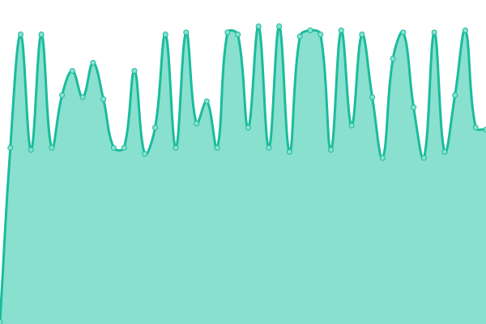 117ms
     
 | 

<a href="https://freehostinguptime.tinkerhost.net/history/h39">65.73%</a>
    

|  H40 | 🟥 Down | [h40.yml](https://github.com/TinkerHost/upptime-free-hosting-servers/commits/HEAD/history/h40.yml) | 

 110ms
     
 | 

<a href="https://freehostinguptime.tinkerhost.net/history/h40">65.22%</a>
    

|  H41 | 🟥 Down | [h41.yml](https://github.com/TinkerHost/upptime-free-hosting-servers/commits/HEAD/history/h41.yml) | 

 118ms
     
 | 

<a href="https://freehostinguptime.tinkerhost.net/history/h41">66.31%</a>
    

|  H42 | 🟥 Down | [h42.yml](https://github.com/TinkerHost/upptime-free-hosting-servers/commits/HEAD/history/h42.yml) | 

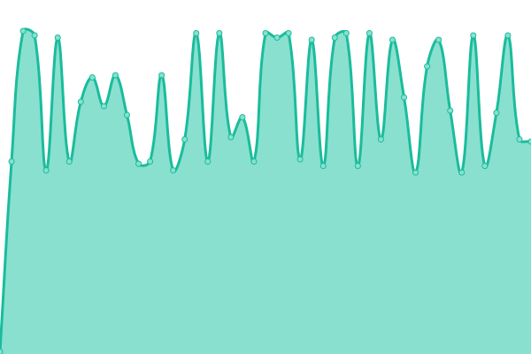 110ms
     
 | 

<a href="https://freehostinguptime.tinkerhost.net/history/h42">66.53%</a>
    

|  H43 | 🟥 Down | [h43.yml](https://github.com/TinkerHost/upptime-free-hosting-servers/commits/HEAD/history/h43.yml) | 

 109ms
     
 | 

<a href="https://freehostinguptime.tinkerhost.net/history/h43">63.64%</a>
    

|  H44 | 🟥 Down | [h44.yml](https://github.com/TinkerHost/upptime-free-hosting-servers/commits/HEAD/history/h44.yml) | 

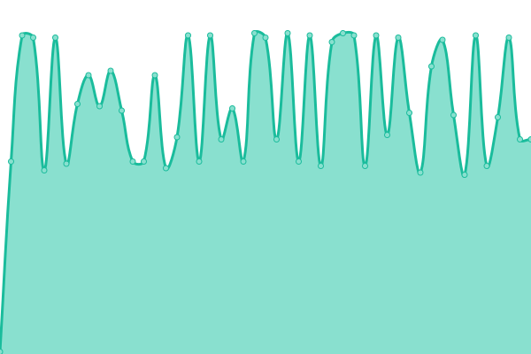 110ms
     
 | 

<a href="https://freehostinguptime.tinkerhost.net/history/h44">66.29%</a>
    

|  H45 | 🟥 Down | [h45.yml](https://github.com/TinkerHost/upptime-free-hosting-servers/commits/HEAD/history/h45.yml) | 

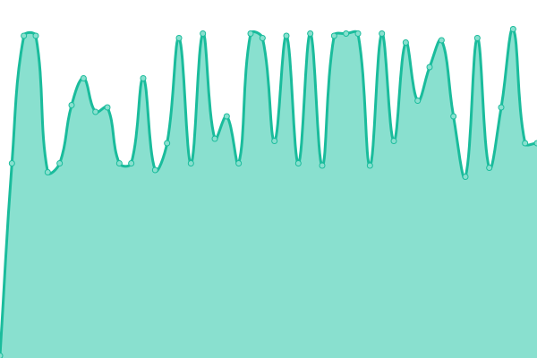 110ms
     
 | 

<a href="https://freehostinguptime.tinkerhost.net/history/h45">66.56%</a>
    

|  H46 | 🟥 Down | [h46.yml](https://github.com/TinkerHost/upptime-free-hosting-servers/commits/HEAD/history/h46.yml) | 

 111ms
     
 | 

<a href="https://freehostinguptime.tinkerhost.net/history/h46">67.56%</a>
    

|  H47 | 🟥 Down | [h47.yml](https://github.com/TinkerHost/upptime-free-hosting-servers/commits/HEAD/history/h47.yml) | 

 118ms
     
 | 

<a href="https://freehostinguptime.tinkerhost.net/history/h47">67.09%</a>
    

|  H50 | 🟥 Down | [h50.yml](https://github.com/TinkerHost/upptime-free-hosting-servers/commits/HEAD/history/h50.yml) | 

 118ms
     
 | 

<a href="https://freehostinguptime.tinkerhost.net/history/h50">65.17%</a>
    

|  H55 | 🟥 Down | [h55.yml](https://github.com/TinkerHost/upptime-free-hosting-servers/commits/HEAD/history/h55.yml) | 

 110ms
     
 | 

<a href="https://freehostinguptime.tinkerhost.net/history/h55">65.43%</a>
    

|  H57 | 🟥 Down | [h57.yml](https://github.com/TinkerHost/upptime-free-hosting-servers/commits/HEAD/history/h57.yml) | 

 110ms
     
 | 

<a href="https://freehostinguptime.tinkerhost.net/history/h57">65.70%</a>
    

|  H59 | 🟥 Down | [h59.yml](https://github.com/TinkerHost/upptime-free-hosting-servers/commits/HEAD/history/h59.yml) | 

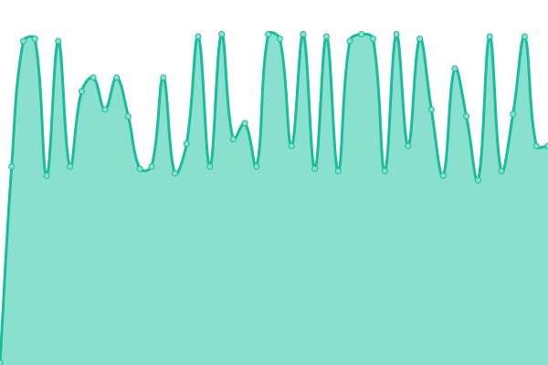 117ms
     
 | 

<a href="https://freehostinguptime.tinkerhost.net/history/h59">65.97%</a>
    

|  H60 | 🟥 Down | [h60.yml](https://github.com/TinkerHost/upptime-free-hosting-servers/commits/HEAD/history/h60.yml) | 

 110ms
     
 | 

<a href="https://freehostinguptime.tinkerhost.net/history/h60">66.24%</a>
    

|  H65 | 🟥 Down | [h65.yml](https://github.com/TinkerHost/upptime-free-hosting-servers/commits/HEAD/history/h65.yml) | 

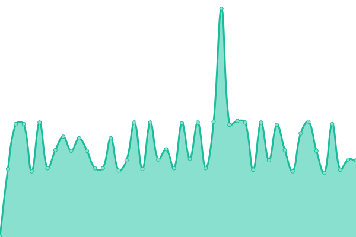 110ms
     
 | 

<a href="https://freehostinguptime.tinkerhost.net/history/h65">51.90%</a>
    

|  H98 | 🟥 Down | [h98.yml](https://github.com/TinkerHost/upptime-free-hosting-servers/commits/HEAD/history/h98.yml) | 

 110ms
     
 | 

<a href="https://freehostinguptime.tinkerhost.net/history/h98">66.78%</a>
    

|  T100 | 🟥 Down | [t100.yml](https://github.com/TinkerHost/upptime-free-hosting-servers/commits/HEAD/history/t100.yml) | 

 110ms
     
 | 

<a href="https://freehostinguptime.tinkerhost.net/history/t100">67.05%</a>
    

|  T102 | 🟥 Down | [t102.yml](https://github.com/TinkerHost/upptime-free-hosting-servers/commits/HEAD/history/t102.yml) | 

 110ms
     
 | 

<a href="https://freehostinguptime.tinkerhost.net/history/t102">67.32%</a>
    

|  T103 | 🟥 Down | [t103.yml](https://github.com/TinkerHost/upptime-free-hosting-servers/commits/HEAD/history/t103.yml) | 

 110ms
     
 | 

<a href="https://freehostinguptime.tinkerhost.net/history/t103">63.01%</a>
    

|  T104 | 🟥 Down | [t104.yml](https://github.com/TinkerHost/upptime-free-hosting-servers/commits/HEAD/history/t104.yml) | 

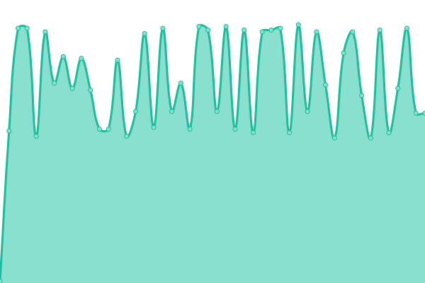 111ms
     
 | 

<a href="https://freehostinguptime.tinkerhost.net/history/t104">68.43%</a>
    

|  T105 | 🟥 Down | [t105.yml](https://github.com/TinkerHost/upptime-free-hosting-servers/commits/HEAD/history/t105.yml) | 

 158ms
     
 | 

<a href="https://freehostinguptime.tinkerhost.net/history/t105">68.98%</a>
    

|  T106 | 🟥 Down | [t106.yml](https://github.com/TinkerHost/upptime-free-hosting-servers/commits/HEAD/history/t106.yml) | 

 135ms
     
 | 

<a href="https://freehostinguptime.tinkerhost.net/history/t106">69.24%</a>
    

|  T107 | 🟥 Down | [t107.yml](https://github.com/TinkerHost/upptime-free-hosting-servers/commits/HEAD/history/t107.yml) | 

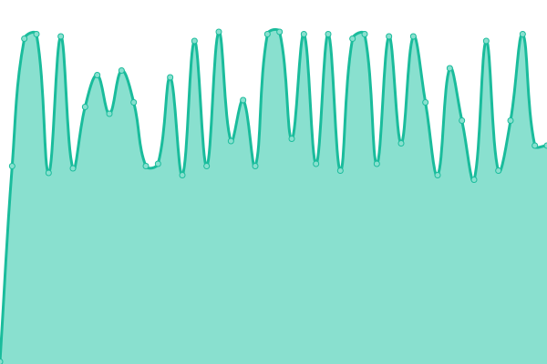 111ms
     
 | 

<a href="https://freehostinguptime.tinkerhost.net/history/t107">68.64%</a>
    

|  T108 | 🟩 Up | [t108.yml](https://github.com/TinkerHost/upptime-free-hosting-servers/commits/HEAD/history/t108.yml) | 

 152ms
     
 | 

<a href="https://freehostinguptime.tinkerhost.net/history/t108">60.75%</a>
    

|  T109 | 🟩 Up | [t109.yml](https://github.com/TinkerHost/upptime-free-hosting-servers/commits/HEAD/history/t109.yml) | 

 135ms
     
 | 

<a href="https://freehostinguptime.tinkerhost.net/history/t109">61.43%</a>
    

|  T110 | 🟥 Down | [t110.yml](https://github.com/TinkerHost/upptime-free-hosting-servers/commits/HEAD/history/t110.yml) | 

 143ms
     
 | 

<a href="https://freehostinguptime.tinkerhost.net/history/t110">60.15%</a>
    

|  T111 | 🟥 Down | [t111.yml](https://github.com/TinkerHost/upptime-free-hosting-servers/commits/HEAD/history/t111.yml) | 

 165ms
     
 | 

<a href="https://freehostinguptime.tinkerhost.net/history/t111">60.42%</a>
    

|  T112 | 🟥 Down | [t112.yml](https://github.com/TinkerHost/upptime-free-hosting-servers/commits/HEAD/history/t112.yml) | 

 140ms
     
 | 

<a href="https://freehostinguptime.tinkerhost.net/history/t112">60.69%</a>
    

|  T114 | 🟥 Down | [t114.yml](https://github.com/TinkerHost/upptime-free-hosting-servers/commits/HEAD/history/t114.yml) | 

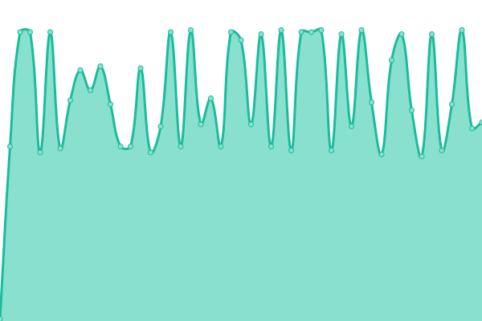 110ms
     
 | 

<a href="https://freehostinguptime.tinkerhost.net/history/t114">60.95%</a>
    

|  T116 | 🟥 Down | [t116.yml](https://github.com/TinkerHost/upptime-free-hosting-servers/commits/HEAD/history/t116.yml) | 

 111ms
     
 | 

<a href="https://freehostinguptime.tinkerhost.net/history/t116">61.22%</a>
    

|  T117 | 🟥 Down | [t117.yml](https://github.com/TinkerHost/upptime-free-hosting-servers/commits/HEAD/history/t117.yml) | 

 110ms
     
 | 

<a href="https://freehostinguptime.tinkerhost.net/history/t117">55.53%</a>
    

|  T118 | 🟥 Down | [t118.yml](https://github.com/TinkerHost/upptime-free-hosting-servers/commits/HEAD/history/t118.yml) | 

 117ms
     
 | 

<a href="https://freehostinguptime.tinkerhost.net/history/t118">52.36%</a>
    

|  T120 | 🟥 Down | [t120.yml](https://github.com/TinkerHost/upptime-free-hosting-servers/commits/HEAD/history/t120.yml) | 

 119ms
     
 | 

<a href="https://freehostinguptime.tinkerhost.net/history/t120">52.81%</a>
    

|  T124 | 🟥 Down | [t124.yml](https://github.com/TinkerHost/upptime-free-hosting-servers/commits/HEAD/history/t124.yml) | 

 118ms
     
 | 

<a href="https://freehostinguptime.tinkerhost.net/history/t124">56.33%</a>
    

|  T125 | 🟥 Down | [t125.yml](https://github.com/TinkerHost/upptime-free-hosting-servers/commits/HEAD/history/t125.yml) | 

 109ms
     
 | 

<a href="https://freehostinguptime.tinkerhost.net/history/t125">57.00%</a>
    

|  T127 | 🟥 Down | [t127.yml](https://github.com/TinkerHost/upptime-free-hosting-servers/commits/HEAD/history/t127.yml) | 

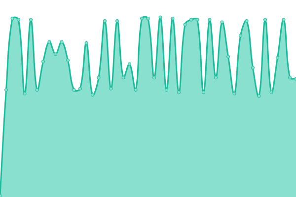 117ms
     
 | 

<a href="https://freehostinguptime.tinkerhost.net/history/t127">56.42%</a>
    

|  T128 | 🟥 Down | [t128.yml](https://github.com/TinkerHost/upptime-free-hosting-servers/commits/HEAD/history/t128.yml) | 

 110ms
     
 | 

<a href="https://freehostinguptime.tinkerhost.net/history/t128">55.31%</a>
    

|  T134 | 🟥 Down | [t134.yml](https://github.com/TinkerHost/upptime-free-hosting-servers/commits/HEAD/history/t134.yml) | 

 108ms
     
 | 

<a href="https://freehostinguptime.tinkerhost.net/history/t134">57.75%</a>
    

|  T135 | 🟥 Down | [t135.yml](https://github.com/TinkerHost/upptime-free-hosting-servers/commits/HEAD/history/t135.yml) | 

 110ms
     
 | 

<a href="https://freehostinguptime.tinkerhost.net/history/t135">57.64%</a>
    

|  T136 | 🟥 Down | [t136.yml](https://github.com/TinkerHost/upptime-free-hosting-servers/commits/HEAD/history/t136.yml) | 

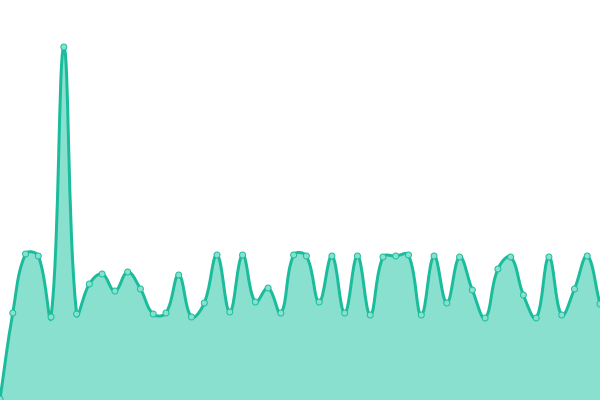 110ms
     
 | 

<a href="https://freehostinguptime.tinkerhost.net/history/t136">67.17%</a>
    

|  T137 | 🟥 Down | [t137.yml](https://github.com/TinkerHost/upptime-free-hosting-servers/commits/HEAD/history/t137.yml) | 

 110ms
     
 | 

<a href="https://freehostinguptime.tinkerhost.net/history/t137">58.17%</a>
    

|  T138 | 🟥 Down | [t138.yml](https://github.com/TinkerHost/upptime-free-hosting-servers/commits/HEAD/history/t138.yml) | 

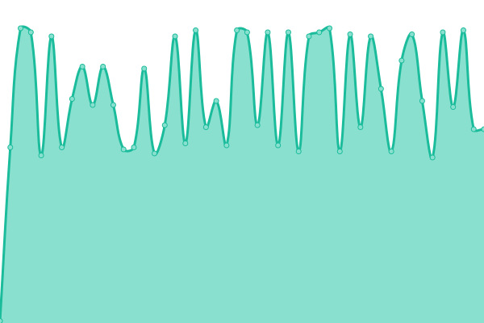 117ms
     
 | 

<a href="https://freehostinguptime.tinkerhost.net/history/t138">59.18%</a>
    

|  T145 | 🟥 Down | [t145.yml](https://github.com/TinkerHost/upptime-free-hosting-servers/commits/HEAD/history/t145.yml) | 

 110ms
     
 | 

<a href="https://freehostinguptime.tinkerhost.net/history/t145">58.70%</a>
    

|  T146 | 🟥 Down | [t146.yml](https://github.com/TinkerHost/upptime-free-hosting-servers/commits/HEAD/history/t146.yml) | 

 110ms
     
 | 

<a href="https://freehostinguptime.tinkerhost.net/history/t146">58.97%</a>
    

|  T147 | 🟥 Down | [t147.yml](https://github.com/TinkerHost/upptime-free-hosting-servers/commits/HEAD/history/t147.yml) | 

 109ms
     
 | 

<a href="https://freehostinguptime.tinkerhost.net/history/t147">59.49%</a>
    

|  T148 | 🟥 Down | [t148.yml](https://github.com/TinkerHost/upptime-free-hosting-servers/commits/HEAD/history/t148.yml) | 

 109ms
     
 | 

<a href="https://freehostinguptime.tinkerhost.net/history/t148">60.03%</a>
    

|  T153 | 🟥 Down | [t153.yml](https://github.com/TinkerHost/upptime-free-hosting-servers/commits/HEAD/history/t153.yml) | 

 110ms
     
 | 

<a href="https://freehostinguptime.tinkerhost.net/history/t153">59.77%</a>
    

|  T154 | 🟥 Down | [t154.yml](https://github.com/TinkerHost/upptime-free-hosting-servers/commits/HEAD/history/t154.yml) | 

 118ms
     
 | 

<a href="https://freehostinguptime.tinkerhost.net/history/t154">60.04%</a>
    

|  T155 | 🟩 Up | [t155.yml](https://github.com/TinkerHost/upptime-free-hosting-servers/commits/HEAD/history/t155.yml) | 

 118ms
     
 | 

<a href="https://freehostinguptime.tinkerhost.net/history/t155">60.31%</a>
    

|  T160 | 🟥 Down | [t160.yml](https://github.com/TinkerHost/upptime-free-hosting-servers/commits/HEAD/history/t160.yml) | 

 110ms
     
 | 

<a href="https://freehostinguptime.tinkerhost.net/history/t160">60.58%</a>
    

|  T162 | 🟥 Down | [t162.yml](https://github.com/TinkerHost/upptime-free-hosting-servers/commits/HEAD/history/t162.yml) | 

 110ms
     
 | 

<a href="https://freehostinguptime.tinkerhost.net/history/t162">60.85%</a>
    

|  T163 | 🟥 Down | [t163.yml](https://github.com/TinkerHost/upptime-free-hosting-servers/commits/HEAD/history/t163.yml) | 

 110ms
     
 | 

<a href="https://freehostinguptime.tinkerhost.net/history/t163">61.12%</a>
    

|  T164 | 🟥 Down | [t164.yml](https://github.com/TinkerHost/upptime-free-hosting-servers/commits/HEAD/history/t164.yml) | 

 118ms
     
 | 

<a href="https://freehostinguptime.tinkerhost.net/history/t164">61.39%</a>
    

|  T165 | 🟥 Down | [t165.yml](https://github.com/TinkerHost/upptime-free-hosting-servers/commits/HEAD/history/t165.yml) | 

 110ms
     
 | 

<a href="https://freehostinguptime.tinkerhost.net/history/t165">61.81%</a>
    

|  T166 | 🟥 Down | [t166.yml](https://github.com/TinkerHost/upptime-free-hosting-servers/commits/HEAD/history/t166.yml) | 

 118ms
     
 | 

<a href="https://freehostinguptime.tinkerhost.net/history/t166">62.07%</a>
    

|  T167 | 🟥 Down | [t167.yml](https://github.com/TinkerHost/upptime-free-hosting-servers/commits/HEAD/history/t167.yml) | 

 118ms
     
 | 

<a href="https://freehostinguptime.tinkerhost.net/history/t167">62.46%</a>
    

|  T170 | 🟥 Down | [t170.yml](https://github.com/TinkerHost/upptime-free-hosting-servers/commits/HEAD/history/t170.yml) | 

 110ms
     
 | 

<a href="https://freehostinguptime.tinkerhost.net/history/t170">65.58%</a>
    

|  T171 | 🟥 Down | [t171.yml](https://github.com/TinkerHost/upptime-free-hosting-servers/commits/HEAD/history/t171.yml) | 

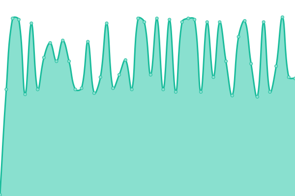 110ms
     
 | 

<a href="https://freehostinguptime.tinkerhost.net/history/t171">62.75%</a>
    

|  T172 | 🟩 Up | [t172.yml](https://github.com/TinkerHost/upptime-free-hosting-servers/commits/HEAD/history/t172.yml) | 

 120ms
     
 | 

<a href="https://freehostinguptime.tinkerhost.net/history/t172">58.25%</a>
    

|  T174 | 🟥 Down | [t174.yml](https://github.com/TinkerHost/upptime-free-hosting-servers/commits/HEAD/history/t174.yml) | 

 111ms
     
 | 

<a href="https://freehostinguptime.tinkerhost.net/history/t174">62.30%</a>
    

<!--end: status pages-->

[**Visit our status website →**](https://freehostinguptime.tinkerhost.net)

## 📄 License

- Powered by: [Upptime](https://github.com/upptime/upptime)
- Code: [MIT](./LICENSE) © [Anand Chowdhary](https://anandchowdhary.com), supported by [Pabio](https://pabio.com)
- Data in the `./history` directory: [Open Database License](https://opendatacommons.org/licenses/odbl/1-0/)
