# [📈 Live Status](https://freehostinguptime.tinkerhost.net): <!--live status--> **🟩 All systems operational**

This repository contains the open-source uptime monitor and status page for [TinkerHost](https://tinkerhost.net), powered by [Upptime](https://github.com/upptime/upptime).

With [Upptime](https://upptime.js.org), you can get your own unlimited and free uptime monitor and status page, powered entirely by a GitHub repository. We use [Issues](https://github.com/TinkerHost/upptime-free-hosting-servers/issues) as incident reports, [Actions](https://github.com/TinkerHost/upptime-free-hosting-servers/actions) as uptime monitors, and [Pages](https://freehostinguptime.tinkerhost.net) for the status page.

<!--start: status pages-->
<!-- This summary is generated by Upptime (https://github.com/upptime/upptime) -->
<!-- Do not edit this manually, your changes will be overwritten -->
<!-- prettier-ignore -->
| URL | Status | History | Response Time | Uptime |
| --- | ------ | ------- | ------------- | ------ |
|  B183 | 🟩 Up | [b183.yml](https://github.com/TinkerHost/upptime-free-hosting-servers/commits/HEAD/history/b183.yml) | 

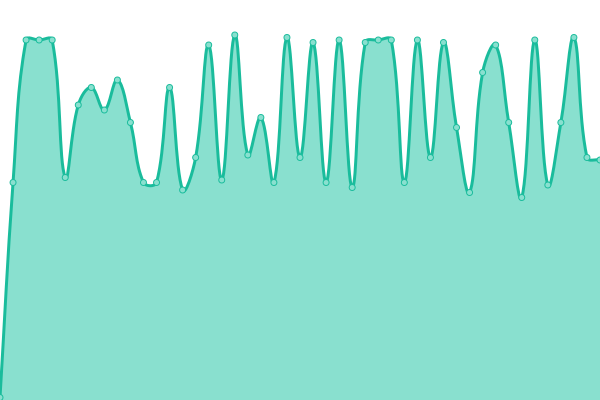 112ms
     
 | 

<a href="https://freehostinguptime.tinkerhost.net/history/b183">40.14%</a>
    

|  A185 | 🟩 Up | [a185.yml](https://github.com/TinkerHost/upptime-free-hosting-servers/commits/HEAD/history/a185.yml) | 

 112ms
     
 | 

<a href="https://freehostinguptime.tinkerhost.net/history/a185">37.20%</a>
    

|  H101 | 🟩 Up | [h101.yml](https://github.com/TinkerHost/upptime-free-hosting-servers/commits/HEAD/history/h101.yml) | 

 122ms
     
 | 

<a href="https://freehostinguptime.tinkerhost.net/history/h101">35.08%</a>
    

|  H113 | 🟩 Up | [h113.yml](https://github.com/TinkerHost/upptime-free-hosting-servers/commits/HEAD/history/h113.yml) | 

 112ms
     
 | 

<a href="https://freehostinguptime.tinkerhost.net/history/h113">41.41%</a>
    

|  H115 | 🟩 Up | [h115.yml](https://github.com/TinkerHost/upptime-free-hosting-servers/commits/HEAD/history/h115.yml) | 

 112ms
     
 | 

<a href="https://freehostinguptime.tinkerhost.net/history/h115">42.04%</a>
    

|  H126 | 🟩 Up | [h126.yml](https://github.com/TinkerHost/upptime-free-hosting-servers/commits/HEAD/history/h126.yml) | 

 112ms
     
 | 

<a href="https://freehostinguptime.tinkerhost.net/history/h126">42.36%</a>
    

|  H129 | 🟩 Up | [h129.yml](https://github.com/TinkerHost/upptime-free-hosting-servers/commits/HEAD/history/h129.yml) | 

 117ms
     
 | 

<a href="https://freehostinguptime.tinkerhost.net/history/h129">49.83%</a>
    

|  H130 | 🟩 Up | [h130.yml](https://github.com/TinkerHost/upptime-free-hosting-servers/commits/HEAD/history/h130.yml) | 

 112ms
     
 | 

<a href="https://freehostinguptime.tinkerhost.net/history/h130">49.11%</a>
    

|  H131 | 🟩 Up | [h131.yml](https://github.com/TinkerHost/upptime-free-hosting-servers/commits/HEAD/history/h131.yml) | 

 116ms
     
 | 

<a href="https://freehostinguptime.tinkerhost.net/history/h131">42.95%</a>
    

|  H132 | 🟩 Up | [h132.yml](https://github.com/TinkerHost/upptime-free-hosting-servers/commits/HEAD/history/h132.yml) | 

 121ms
     
 | 

<a href="https://freehostinguptime.tinkerhost.net/history/h132">43.42%</a>
    

|  H133 | 🟩 Up | [h133.yml](https://github.com/TinkerHost/upptime-free-hosting-servers/commits/HEAD/history/h133.yml) | 

 112ms
     
 | 

<a href="https://freehostinguptime.tinkerhost.net/history/h133">37.48%</a>
    

|  H139 | 🟩 Up | [h139.yml](https://github.com/TinkerHost/upptime-free-hosting-servers/commits/HEAD/history/h139.yml) | 

 118ms
     
 | 

<a href="https://freehostinguptime.tinkerhost.net/history/h139">37.91%</a>
    

|  H140 | 🟩 Up | [h140.yml](https://github.com/TinkerHost/upptime-free-hosting-servers/commits/HEAD/history/h140.yml) | 

 112ms
     
 | 

<a href="https://freehostinguptime.tinkerhost.net/history/h140">38.33%</a>
    

|  H142 | 🟩 Up | [h142.yml](https://github.com/TinkerHost/upptime-free-hosting-servers/commits/HEAD/history/h142.yml) | 

 117ms
     
 | 

<a href="https://freehostinguptime.tinkerhost.net/history/h142">40.27%</a>
    

|  H143 | 🟩 Up | [h143.yml](https://github.com/TinkerHost/upptime-free-hosting-servers/commits/HEAD/history/h143.yml) | 

 112ms
     
 | 

<a href="https://freehostinguptime.tinkerhost.net/history/h143">38.27%</a>
    

|  H144 | 🟩 Up | [h144.yml](https://github.com/TinkerHost/upptime-free-hosting-servers/commits/HEAD/history/h144.yml) | 

 111ms
     
 | 

<a href="https://freehostinguptime.tinkerhost.net/history/h144">41.32%</a>
    

|  H149 | 🟩 Up | [h149.yml](https://github.com/TinkerHost/upptime-free-hosting-servers/commits/HEAD/history/h149.yml) | 

 112ms
     
 | 

<a href="https://freehostinguptime.tinkerhost.net/history/h149">36.24%</a>
    

|  H150 | 🟩 Up | [h150.yml](https://github.com/TinkerHost/upptime-free-hosting-servers/commits/HEAD/history/h150.yml) | 

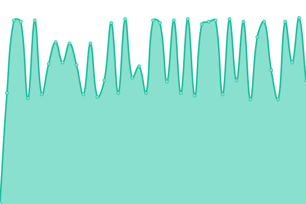 113ms
     
 | 

<a href="https://freehostinguptime.tinkerhost.net/history/h150">37.05%</a>
    

|  H151 | 🟩 Up | [h151.yml](https://github.com/TinkerHost/upptime-free-hosting-servers/commits/HEAD/history/h151.yml) | 

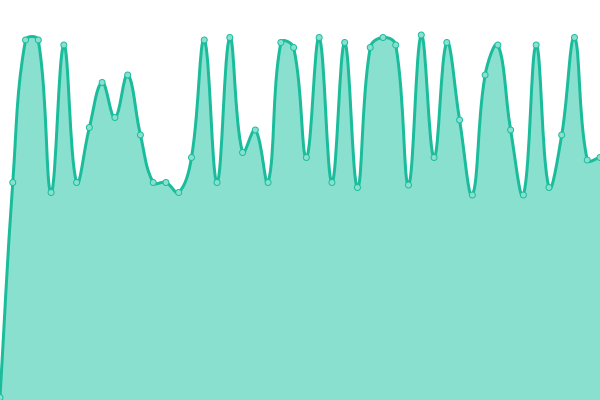 112ms
     
 | 

<a href="https://freehostinguptime.tinkerhost.net/history/h151">39.03%</a>
    

|  H176 | 🟩 Up | [h176.yml](https://github.com/TinkerHost/upptime-free-hosting-servers/commits/HEAD/history/h176.yml) | 

 117ms
     
 | 

<a href="https://freehostinguptime.tinkerhost.net/history/h176">38.40%</a>
    

|  H202 | 🟩 Up | [h202.yml](https://github.com/TinkerHost/upptime-free-hosting-servers/commits/HEAD/history/h202.yml) | 

 112ms
     
 | 

<a href="https://freehostinguptime.tinkerhost.net/history/h202">38.83%</a>
    

|  H214 | 🟩 Up | [h214.yml](https://github.com/TinkerHost/upptime-free-hosting-servers/commits/HEAD/history/h214.yml) | 

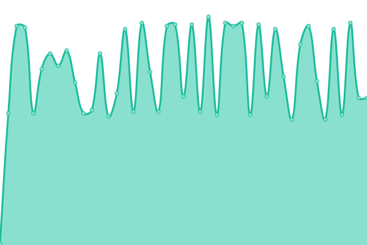 112ms
     
 | 

<a href="https://freehostinguptime.tinkerhost.net/history/h214">39.26%</a>
    

|  H215 | 🟩 Up | [h215.yml](https://github.com/TinkerHost/upptime-free-hosting-servers/commits/HEAD/history/h215.yml) | 

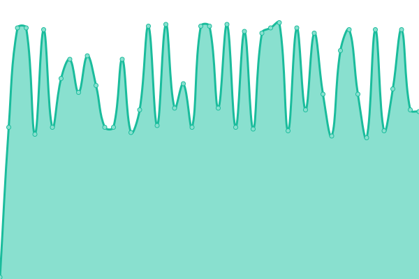 113ms
     
 | 

<a href="https://freehostinguptime.tinkerhost.net/history/h215">39.00%</a>
    

|  H217 | 🟩 Up | [h217.yml](https://github.com/TinkerHost/upptime-free-hosting-servers/commits/HEAD/history/h217.yml) | 

 113ms
     
 | 

<a href="https://freehostinguptime.tinkerhost.net/history/h217">40.03%</a>
    

|  H218 | 🟩 Up | [h218.yml](https://github.com/TinkerHost/upptime-free-hosting-servers/commits/HEAD/history/h218.yml) | 

 117ms
     
 | 

<a href="https://freehostinguptime.tinkerhost.net/history/h218">40.39%</a>
    

|  H219 | 🟩 Up | [h219.yml](https://github.com/TinkerHost/upptime-free-hosting-servers/commits/HEAD/history/h219.yml) | 

 117ms
     
 | 

<a href="https://freehostinguptime.tinkerhost.net/history/h219">40.82%</a>
    

|  H221 | 🟩 Up | [h221.yml](https://github.com/TinkerHost/upptime-free-hosting-servers/commits/HEAD/history/h221.yml) | 

 113ms
     
 | 

<a href="https://freehostinguptime.tinkerhost.net/history/h221">40.48%</a>
    

|  H222 | 🟩 Up | [h222.yml](https://github.com/TinkerHost/upptime-free-hosting-servers/commits/HEAD/history/h222.yml) | 

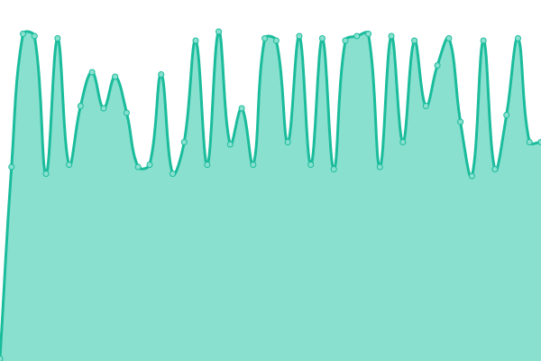 111ms
     
 | 

<a href="https://freehostinguptime.tinkerhost.net/history/h222">39.29%</a>
    

|  H223 | 🟩 Up | [h223.yml](https://github.com/TinkerHost/upptime-free-hosting-servers/commits/HEAD/history/h223.yml) | 

 113ms
     
 | 

<a href="https://freehostinguptime.tinkerhost.net/history/h223">40.54%</a>
    

|  H224 | 🟩 Up | [h224.yml](https://github.com/TinkerHost/upptime-free-hosting-servers/commits/HEAD/history/h224.yml) | 

 112ms
     
 | 

<a href="https://freehostinguptime.tinkerhost.net/history/h224">40.37%</a>
    

|  H232 | 🟩 Up | [h232.yml](https://github.com/TinkerHost/upptime-free-hosting-servers/commits/HEAD/history/h232.yml) | 

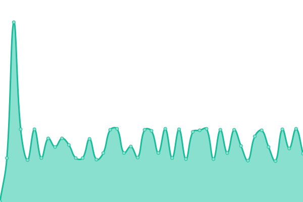 112ms
     
 | 

<a href="https://freehostinguptime.tinkerhost.net/history/h232">38.29%</a>
    

|  H33 | 🟩 Up | [h33.yml](https://github.com/TinkerHost/upptime-free-hosting-servers/commits/HEAD/history/h33.yml) | 

 112ms
     
 | 

<a href="https://freehostinguptime.tinkerhost.net/history/h33">37.96%</a>
    

|  H34 | 🟩 Up | [h34.yml](https://github.com/TinkerHost/upptime-free-hosting-servers/commits/HEAD/history/h34.yml) | 

 113ms
     
 | 

<a href="https://freehostinguptime.tinkerhost.net/history/h34">38.61%</a>
    

|  H36 | 🟩 Up | [h36.yml](https://github.com/TinkerHost/upptime-free-hosting-servers/commits/HEAD/history/h36.yml) | 

 112ms
     
 | 

<a href="https://freehostinguptime.tinkerhost.net/history/h36">39.34%</a>
    

|  H37 | 🟩 Up | [h37.yml](https://github.com/TinkerHost/upptime-free-hosting-servers/commits/HEAD/history/h37.yml) | 

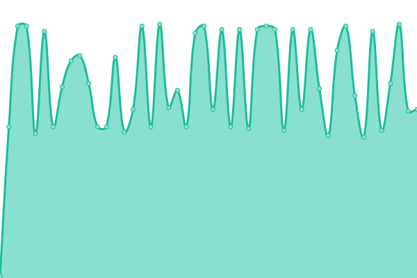 117ms
     
 | 

<a href="https://freehostinguptime.tinkerhost.net/history/h37">39.78%</a>
    

|  H38 | 🟩 Up | [h38.yml](https://github.com/TinkerHost/upptime-free-hosting-servers/commits/HEAD/history/h38.yml) | 

 112ms
     
 | 

<a href="https://freehostinguptime.tinkerhost.net/history/h38">40.22%</a>
    

|  H39 | 🟩 Up | [h39.yml](https://github.com/TinkerHost/upptime-free-hosting-servers/commits/HEAD/history/h39.yml) | 

 110ms
     
 | 

<a href="https://freehostinguptime.tinkerhost.net/history/h39">37.12%</a>
    

|  H40 | 🟩 Up | [h40.yml](https://github.com/TinkerHost/upptime-free-hosting-servers/commits/HEAD/history/h40.yml) | 

 112ms
     
 | 

<a href="https://freehostinguptime.tinkerhost.net/history/h40">43.67%</a>
    

|  H41 | 🟩 Up | [h41.yml](https://github.com/TinkerHost/upptime-free-hosting-servers/commits/HEAD/history/h41.yml) | 

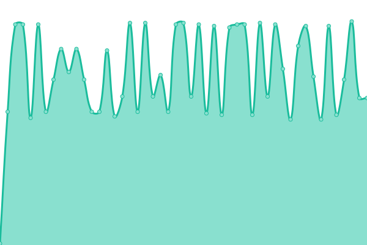 117ms
     
 | 

<a href="https://freehostinguptime.tinkerhost.net/history/h41">43.59%</a>
    

|  H42 | 🟩 Up | [h42.yml](https://github.com/TinkerHost/upptime-free-hosting-servers/commits/HEAD/history/h42.yml) | 

 113ms
     
 | 

<a href="https://freehostinguptime.tinkerhost.net/history/h42">40.55%</a>
    

|  H43 | 🟩 Up | [h43.yml](https://github.com/TinkerHost/upptime-free-hosting-servers/commits/HEAD/history/h43.yml) | 

 118ms
     
 | 

<a href="https://freehostinguptime.tinkerhost.net/history/h43">41.55%</a>
    

|  H44 | 🟩 Up | [h44.yml](https://github.com/TinkerHost/upptime-free-hosting-servers/commits/HEAD/history/h44.yml) | 

 113ms
     
 | 

<a href="https://freehostinguptime.tinkerhost.net/history/h44">41.94%</a>
    

|  H45 | 🟩 Up | [h45.yml](https://github.com/TinkerHost/upptime-free-hosting-servers/commits/HEAD/history/h45.yml) | 

 112ms
     
 | 

<a href="https://freehostinguptime.tinkerhost.net/history/h45">40.02%</a>
    

|  H46 | 🟩 Up | [h46.yml](https://github.com/TinkerHost/upptime-free-hosting-servers/commits/HEAD/history/h46.yml) | 

 111ms
     
 | 

<a href="https://freehostinguptime.tinkerhost.net/history/h46">39.28%</a>
    

|  H47 | 🟩 Up | [h47.yml](https://github.com/TinkerHost/upptime-free-hosting-servers/commits/HEAD/history/h47.yml) | 

 122ms
     
 | 

<a href="https://freehostinguptime.tinkerhost.net/history/h47">41.46%</a>
    

|  H50 | 🟩 Up | [h50.yml](https://github.com/TinkerHost/upptime-free-hosting-servers/commits/HEAD/history/h50.yml) | 

 112ms
     
 | 

<a href="https://freehostinguptime.tinkerhost.net/history/h50">40.15%</a>
    

|  H55 | 🟩 Up | [h55.yml](https://github.com/TinkerHost/upptime-free-hosting-servers/commits/HEAD/history/h55.yml) | 

 112ms
     
 | 

<a href="https://freehostinguptime.tinkerhost.net/history/h55">40.59%</a>
    

|  H57 | 🟩 Up | [h57.yml](https://github.com/TinkerHost/upptime-free-hosting-servers/commits/HEAD/history/h57.yml) | 

 111ms
     
 | 

<a href="https://freehostinguptime.tinkerhost.net/history/h57">37.21%</a>
    

|  H59 | 🟩 Up | [h59.yml](https://github.com/TinkerHost/upptime-free-hosting-servers/commits/HEAD/history/h59.yml) | 

 112ms
     
 | 

<a href="https://freehostinguptime.tinkerhost.net/history/h59">34.15%</a>
    

|  H60 | 🟩 Up | [h60.yml](https://github.com/TinkerHost/upptime-free-hosting-servers/commits/HEAD/history/h60.yml) | 

 112ms
     
 | 

<a href="https://freehostinguptime.tinkerhost.net/history/h60">32.14%</a>
    

|  H65 | 🟩 Up | [h65.yml](https://github.com/TinkerHost/upptime-free-hosting-servers/commits/HEAD/history/h65.yml) | 

 112ms
     
 | 

<a href="https://freehostinguptime.tinkerhost.net/history/h65">35.58%</a>
    

|  H98 | 🟩 Up | [h98.yml](https://github.com/TinkerHost/upptime-free-hosting-servers/commits/HEAD/history/h98.yml) | 

 111ms
     
 | 

<a href="https://freehostinguptime.tinkerhost.net/history/h98">35.66%</a>
    

|  T100 | 🟩 Up | [t100.yml](https://github.com/TinkerHost/upptime-free-hosting-servers/commits/HEAD/history/t100.yml) | 

 113ms
     
 | 

<a href="https://freehostinguptime.tinkerhost.net/history/t100">34.69%</a>
    

|  T102 | 🟩 Up | [t102.yml](https://github.com/TinkerHost/upptime-free-hosting-servers/commits/HEAD/history/t102.yml) | 

 111ms
     
 | 

<a href="https://freehostinguptime.tinkerhost.net/history/t102">31.08%</a>
    

|  T103 | 🟩 Up | [t103.yml](https://github.com/TinkerHost/upptime-free-hosting-servers/commits/HEAD/history/t103.yml) | 

 110ms
     
 | 

<a href="https://freehostinguptime.tinkerhost.net/history/t103">37.12%</a>
    

|  T104 | 🟩 Up | [t104.yml](https://github.com/TinkerHost/upptime-free-hosting-servers/commits/HEAD/history/t104.yml) | 

 113ms
     
 | 

<a href="https://freehostinguptime.tinkerhost.net/history/t104">34.19%</a>
    

|  T105 | 🟩 Up | [t105.yml](https://github.com/TinkerHost/upptime-free-hosting-servers/commits/HEAD/history/t105.yml) | 

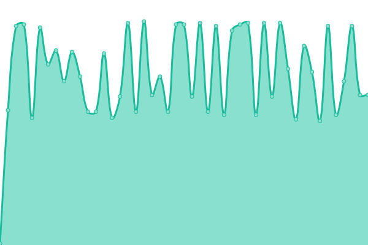 114ms
     
 | 

<a href="https://freehostinguptime.tinkerhost.net/history/t105">33.63%</a>
    

|  T106 | 🟩 Up | [t106.yml](https://github.com/TinkerHost/upptime-free-hosting-servers/commits/HEAD/history/t106.yml) | 

 118ms
     
 | 

<a href="https://freehostinguptime.tinkerhost.net/history/t106">33.68%</a>
    

|  T107 | 🟩 Up | [t107.yml](https://github.com/TinkerHost/upptime-free-hosting-servers/commits/HEAD/history/t107.yml) | 

 110ms
     
 | 

<a href="https://freehostinguptime.tinkerhost.net/history/t107">35.11%</a>
    

|  T108 | 🟩 Up | [t108.yml](https://github.com/TinkerHost/upptime-free-hosting-servers/commits/HEAD/history/t108.yml) | 

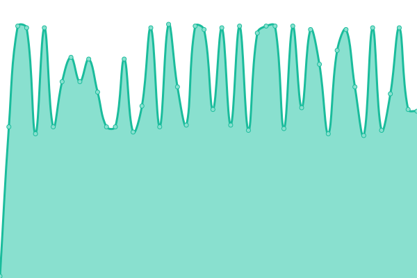 113ms
     
 | 

<a href="https://freehostinguptime.tinkerhost.net/history/t108">36.78%</a>
    

|  T109 | 🟩 Up | [t109.yml](https://github.com/TinkerHost/upptime-free-hosting-servers/commits/HEAD/history/t109.yml) | 

 112ms
     
 | 

<a href="https://freehostinguptime.tinkerhost.net/history/t109">33.81%</a>
    

|  T110 | 🟩 Up | [t110.yml](https://github.com/TinkerHost/upptime-free-hosting-servers/commits/HEAD/history/t110.yml) | 

 112ms
     
 | 

<a href="https://freehostinguptime.tinkerhost.net/history/t110">35.99%</a>
    

|  T111 | 🟩 Up | [t111.yml](https://github.com/TinkerHost/upptime-free-hosting-servers/commits/HEAD/history/t111.yml) | 

 112ms
     
 | 

<a href="https://freehostinguptime.tinkerhost.net/history/t111">37.29%</a>
    

|  T112 | 🟩 Up | [t112.yml](https://github.com/TinkerHost/upptime-free-hosting-servers/commits/HEAD/history/t112.yml) | 

 112ms
     
 | 

<a href="https://freehostinguptime.tinkerhost.net/history/t112">36.02%</a>
    

|  T114 | 🟩 Up | [t114.yml](https://github.com/TinkerHost/upptime-free-hosting-servers/commits/HEAD/history/t114.yml) | 

 111ms
     
 | 

<a href="https://freehostinguptime.tinkerhost.net/history/t114">38.63%</a>
    

|  T116 | 🟩 Up | [t116.yml](https://github.com/TinkerHost/upptime-free-hosting-servers/commits/HEAD/history/t116.yml) | 

 117ms
     
 | 

<a href="https://freehostinguptime.tinkerhost.net/history/t116">40.06%</a>
    

|  T117 | 🟩 Up | [t117.yml](https://github.com/TinkerHost/upptime-free-hosting-servers/commits/HEAD/history/t117.yml) | 

 112ms
     
 | 

<a href="https://freehostinguptime.tinkerhost.net/history/t117">37.30%</a>
    

|  T118 | 🟩 Up | [t118.yml](https://github.com/TinkerHost/upptime-free-hosting-servers/commits/HEAD/history/t118.yml) | 

 112ms
     
 | 

<a href="https://freehostinguptime.tinkerhost.net/history/t118">37.72%</a>
    

|  T120 | 🟩 Up | [t120.yml](https://github.com/TinkerHost/upptime-free-hosting-servers/commits/HEAD/history/t120.yml) | 

 112ms
     
 | 

<a href="https://freehostinguptime.tinkerhost.net/history/t120">37.78%</a>
    

|  T124 | 🟩 Up | [t124.yml](https://github.com/TinkerHost/upptime-free-hosting-servers/commits/HEAD/history/t124.yml) | 

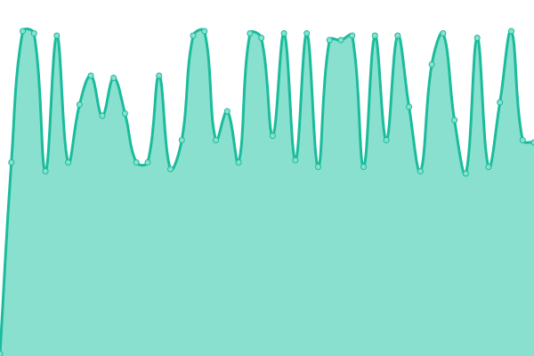 111ms
     
 | 

<a href="https://freehostinguptime.tinkerhost.net/history/t124">38.58%</a>
    

|  T125 | 🟩 Up | [t125.yml](https://github.com/TinkerHost/upptime-free-hosting-servers/commits/HEAD/history/t125.yml) | 

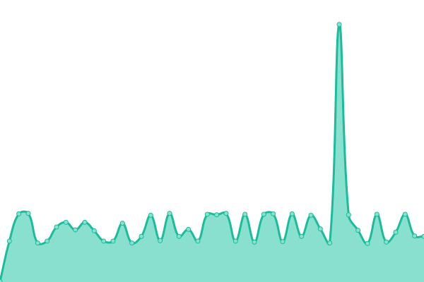 117ms
     
 | 

<a href="https://freehostinguptime.tinkerhost.net/history/t125">39.37%</a>
    

|  T127 | 🟩 Up | [t127.yml](https://github.com/TinkerHost/upptime-free-hosting-servers/commits/HEAD/history/t127.yml) | 

 117ms
     
 | 

<a href="https://freehostinguptime.tinkerhost.net/history/t127">39.45%</a>
    

|  T128 | 🟩 Up | [t128.yml](https://github.com/TinkerHost/upptime-free-hosting-servers/commits/HEAD/history/t128.yml) | 

 111ms
     
 | 

<a href="https://freehostinguptime.tinkerhost.net/history/t128">39.87%</a>
    

|  T134 | 🟩 Up | [t134.yml](https://github.com/TinkerHost/upptime-free-hosting-servers/commits/HEAD/history/t134.yml) | 

 117ms
     
 | 

<a href="https://freehostinguptime.tinkerhost.net/history/t134">40.28%</a>
    

|  T135 | 🟩 Up | [t135.yml](https://github.com/TinkerHost/upptime-free-hosting-servers/commits/HEAD/history/t135.yml) | 

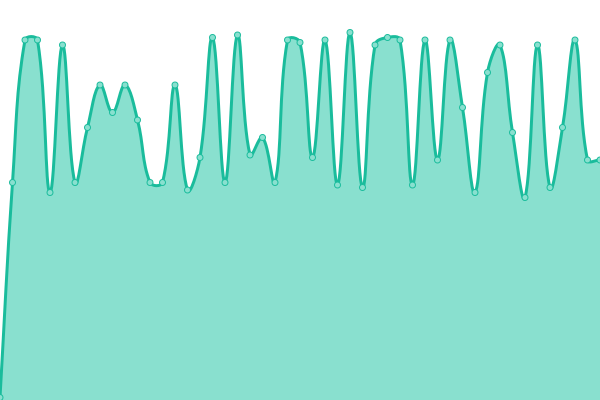 112ms
     
 | 

<a href="https://freehostinguptime.tinkerhost.net/history/t135">40.37%</a>
    

|  T136 | 🟩 Up | [t136.yml](https://github.com/TinkerHost/upptime-free-hosting-servers/commits/HEAD/history/t136.yml) | 

 111ms
     
 | 

<a href="https://freehostinguptime.tinkerhost.net/history/t136">41.35%</a>
    

|  T137 | 🟩 Up | [t137.yml](https://github.com/TinkerHost/upptime-free-hosting-servers/commits/HEAD/history/t137.yml) | 

 123ms
     
 | 

<a href="https://freehostinguptime.tinkerhost.net/history/t137">41.24%</a>
    

|  T138 | 🟩 Up | [t138.yml](https://github.com/TinkerHost/upptime-free-hosting-servers/commits/HEAD/history/t138.yml) | 

 116ms
     
 | 

<a href="https://freehostinguptime.tinkerhost.net/history/t138">38.76%</a>
    

|  T145 | 🟩 Up | [t145.yml](https://github.com/TinkerHost/upptime-free-hosting-servers/commits/HEAD/history/t145.yml) | 

 112ms
     
 | 

<a href="https://freehostinguptime.tinkerhost.net/history/t145">41.71%</a>
    

|  T146 | 🟩 Up | [t146.yml](https://github.com/TinkerHost/upptime-free-hosting-servers/commits/HEAD/history/t146.yml) | 

 112ms
     
 | 

<a href="https://freehostinguptime.tinkerhost.net/history/t146">42.14%</a>
    

|  T147 | 🟩 Up | [t147.yml](https://github.com/TinkerHost/upptime-free-hosting-servers/commits/HEAD/history/t147.yml) | 

 112ms
     
 | 

<a href="https://freehostinguptime.tinkerhost.net/history/t147">42.86%</a>
    

|  T148 | 🟩 Up | [t148.yml](https://github.com/TinkerHost/upptime-free-hosting-servers/commits/HEAD/history/t148.yml) | 

 113ms
     
 | 

<a href="https://freehostinguptime.tinkerhost.net/history/t148">42.26%</a>
    

|  T153 | 🟩 Up | [t153.yml](https://github.com/TinkerHost/upptime-free-hosting-servers/commits/HEAD/history/t153.yml) | 

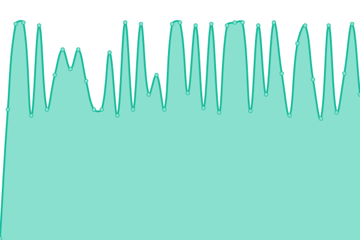 110ms
     
 | 

<a href="https://freehostinguptime.tinkerhost.net/history/t153">42.09%</a>
    

|  T154 | 🟩 Up | [t154.yml](https://github.com/TinkerHost/upptime-free-hosting-servers/commits/HEAD/history/t154.yml) | 

 111ms
     
 | 

<a href="https://freehostinguptime.tinkerhost.net/history/t154">42.23%</a>
    

|  T155 | 🟩 Up | [t155.yml](https://github.com/TinkerHost/upptime-free-hosting-servers/commits/HEAD/history/t155.yml) | 

 112ms
     
 | 

<a href="https://freehostinguptime.tinkerhost.net/history/t155">36.76%</a>
    

|  T160 | 🟩 Up | [t160.yml](https://github.com/TinkerHost/upptime-free-hosting-servers/commits/HEAD/history/t160.yml) | 

 112ms
     
 | 

<a href="https://freehostinguptime.tinkerhost.net/history/t160">36.88%</a>
    

|  T162 | 🟩 Up | [t162.yml](https://github.com/TinkerHost/upptime-free-hosting-servers/commits/HEAD/history/t162.yml) | 

 117ms
     
 | 

<a href="https://freehostinguptime.tinkerhost.net/history/t162">35.00%</a>
    

|  T163 | 🟩 Up | [t163.yml](https://github.com/TinkerHost/upptime-free-hosting-servers/commits/HEAD/history/t163.yml) | 

 113ms
     
 | 

<a href="https://freehostinguptime.tinkerhost.net/history/t163">33.67%</a>
    

|  T164 | 🟩 Up | [t164.yml](https://github.com/TinkerHost/upptime-free-hosting-servers/commits/HEAD/history/t164.yml) | 

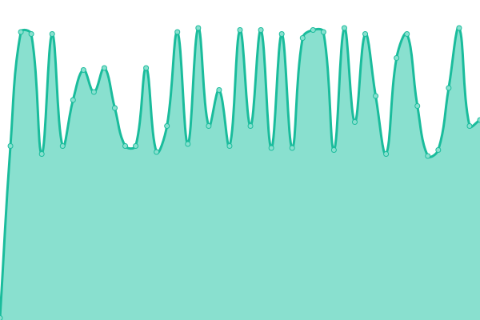 113ms
     
 | 

<a href="https://freehostinguptime.tinkerhost.net/history/t164">33.07%</a>
    

|  T165 | 🟩 Up | [t165.yml](https://github.com/TinkerHost/upptime-free-hosting-servers/commits/HEAD/history/t165.yml) | 

 112ms
     
 | 

<a href="https://freehostinguptime.tinkerhost.net/history/t165">35.28%</a>
    

|  T166 | 🟩 Up | [t166.yml](https://github.com/TinkerHost/upptime-free-hosting-servers/commits/HEAD/history/t166.yml) | 

 112ms
     
 | 

<a href="https://freehostinguptime.tinkerhost.net/history/t166">35.93%</a>
    

|  T167 | 🟩 Up | [t167.yml](https://github.com/TinkerHost/upptime-free-hosting-servers/commits/HEAD/history/t167.yml) | 

 113ms
     
 | 

<a href="https://freehostinguptime.tinkerhost.net/history/t167">35.54%</a>
    

|  T170 | 🟩 Up | [t170.yml](https://github.com/TinkerHost/upptime-free-hosting-servers/commits/HEAD/history/t170.yml) | 

 118ms
     
 | 

<a href="https://freehostinguptime.tinkerhost.net/history/t170">35.63%</a>
    

|  T171 | 🟩 Up | [t171.yml](https://github.com/TinkerHost/upptime-free-hosting-servers/commits/HEAD/history/t171.yml) | 

 111ms
     
 | 

<a href="https://freehostinguptime.tinkerhost.net/history/t171">36.02%</a>
    

|  T172 | 🟩 Up | [t172.yml](https://github.com/TinkerHost/upptime-free-hosting-servers/commits/HEAD/history/t172.yml) | 

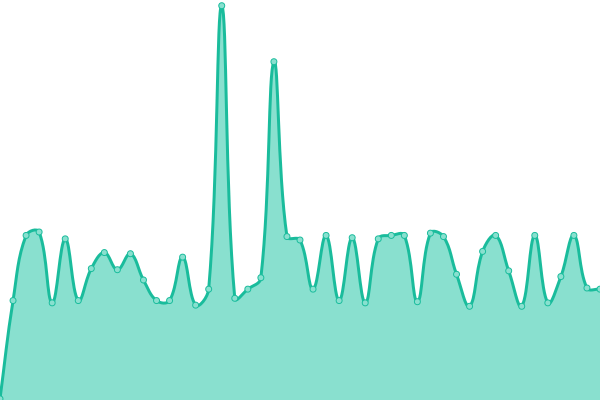 112ms
     
 | 

<a href="https://freehostinguptime.tinkerhost.net/history/t172">34.12%</a>
    

|  T174 | 🟩 Up | [t174.yml](https://github.com/TinkerHost/upptime-free-hosting-servers/commits/HEAD/history/t174.yml) | 

 112ms
     
 | 

<a href="https://freehostinguptime.tinkerhost.net/history/t174">33.65%</a>
    

<!--end: status pages-->

[**Visit our status website →**](https://freehostinguptime.tinkerhost.net)

## 📄 License

- Powered by: [Upptime](https://github.com/upptime/upptime)
- Code: [MIT](./LICENSE) © [Anand Chowdhary](https://anandchowdhary.com), supported by [Pabio](https://pabio.com)
- Data in the `./history` directory: [Open Database License](https://opendatacommons.org/licenses/odbl/1-0/)
